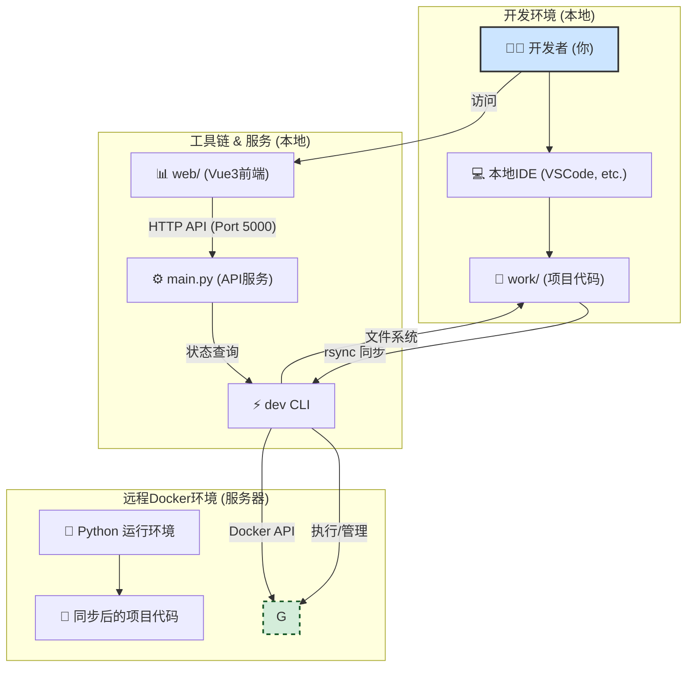
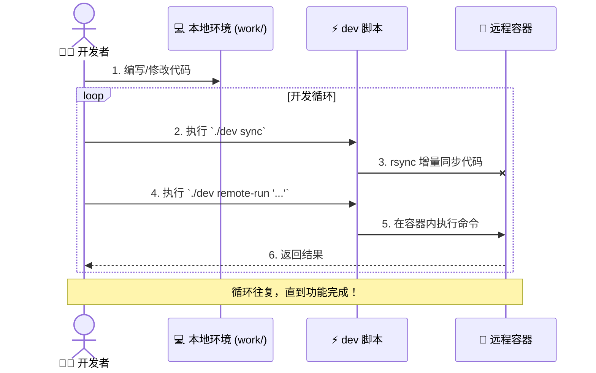

# 🚀 远程开发环境 - 终极精简版 v3.1

> **极致简化，极速开发！** 本地编写代码，远程运行 - 一个工具，全部搞定 💫

[](https://opensource.org/licenses/MIT)
[](https://www.python.org)
[](https://vuejs.org)
[](.)
[](.)

---

## 🎯 核心理念：工作空间分离

本工具的核心设计哲学是 **“工具”与“工作”的彻底分离**。

- **`./` (项目根目录)**: 这是工具本身，包含`dev`脚本、`main.py`后端服务、`docker`配置等。**你不需要修改这里的任何东西。**
- **`work/` (用户工作空间)**: 这是**你的**代码领地。你所有的项目、代码、脚本都应该放在这里。它是你本地的“挂载点”，会自动同步到远程。

> 这种分离确保了工具的更新和维护不会影响到你的项目代码，也让你能专注于自己的工作，而不必关心工具的内部实现。

---

## 🏗️ 系统架构 & 工作流

### 📊 系统架构图



### 🔄 工作流程图



---

## ✨ 核心特性

| 特性 | 描述 |
| :--- | :--- |
| **🚀 极速启动** | 1秒内启动，无需漫长等待。 |
| **🔧 零感配置** | 仅需修改`config.env`中的IP地址即可工作。 |
| **📁 空间分离** | 工具与工作代码完全隔离，互不干扰。`work/`目录受`.gitignore`保护。 |
| **⚡️ 实时同步** | 基于`rsync`的增量同步，快如闪电，支持`watch`模式。|
| **🐳 一致环境** | Docker确保本地和远程环境100%一致，告别“在我机器上能跑”。|
| **🌐 Web UI** | 提供可视化界面，实时监控系统状态、日志和管理配置。|
| **💻 平台无关** | 开发者可在任何操作系统上编码，代码在统一的Linux环境中运行。|
| **💸 零成本** | 完全开源，无任何付费项目。 |

---

## 🚀 快速开始 (5分钟)

### 1. 前置要求
- [Python 3.8+](https://www.python.org/)
- [Git](https://git-scm.com/)
- [Docker](https://www.docker.com/) (远程服务器需要安装)

### 2. 安装
```bash
# 克隆项目
git clone https://github.com/Zhang-Jingdian/remote-dev.git
cd remote-dev

# 安装依赖 (注意路径!)
pip install -r docker/requirements.txt
```

### 3. 配置
打开 `config.env` 文件，**只需要修改远程主机的IP地址**：
```bash
# === 远程开发环境配置 ===
REMOTE_HOST=192.168.1.100  # <--- 修改这里
REMOTE_PATH=/home/zjd/workspace # 远程工作目录
```

### 4. 验证
```bash
# 运行内置的测试套件，确保一切正常
./dev test
```
如果所有测试都显示 `✓`，恭喜你，环境已准备就绪！

---

## 💻 核心工作流

开发过程非常简单，遵循 **“本地编码 -> 同步 -> 远程执行”** 的三步循环。

### 示例: 运行一个Python项目

我们已经为你准备了一个示例项目 `work/example-python-project`。

**第1步: 同步代码**
```bash
# 将本地 work/ 目录中的所有项目同步到远程主机
./dev sync
```

**第2步: 远程执行**
```bash
# 使用 remote-run 命令在远程Docker容器中执行脚本
./dev remote-run python example-python-project/main.py
```
你将看到远程服务器上斐波那契数列的计算结果和系统信息。

**第3步: 本地修改**
现在，在你的本地IDE（如VSCode）中打开 `work/example-python-project/main.py` 并做一些修改，然后重复第1步和第2步。

---

## 📖 CLI 命令参考

`./dev` 脚本是你与远程环境交互的唯一入口。

| 命令 | 功能 |
| :--- | :--- |
| `setup` | **(首次使用)** 在远程主机上创建目录结构并上传初始配置。 |
| `sync` | 将本地`work/`目录通过rsync高效同步到远程。 |
| `watch` | 持续监控`work/`目录的文件变化，并自动执行`sync`。 |
| `up` | 在远程主机上启动Docker容器。 |
| `down` | 停止并移除远程主机上的Docker容器。 |
| `status` | 检查Docker容器的运行状态。 |
| `logs` | 实时查看远程Docker容器的日志输出。 |
| `test` | 运行项目的测试套件，验证工具本身的功能。 |
| `remote-run <CMD>` | **(核心命令)** 在远程运行的Docker容器中执行任何shell命令。 |
| `help` | 显示此帮助信息。 |

---

## ⚙️ 高级用法

### 🌐 Web管理界面
```bash
# 启动本地后端API服务
python3 main.py

# 在浏览器中打开
open http://localhost:5000
```

### 🎨 前端开发
如果你想修改前端界面：
```bash
cd web
npm install
npm run dev
```

---

## 🤝 参与贡献

项目的核心哲学是 **保持简单**。如果你想贡献代码，请确保：
1. **不增加不必要的复杂度**
2. **保持`work`目录的纯净性**
3. **每个功能都有明确价值**
4. **保持代码精简可读**
5. **更新相应的测试**

## 📄 许可证

[MIT License](LICENSE) - 自由使用，自由修改

---

**🎉 享受极简而强大的远程开发体验！**

> 如果这个工具节省了你的时间，请给个 ⭐ Star 支持一下！ 