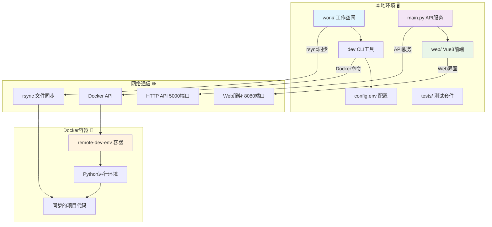
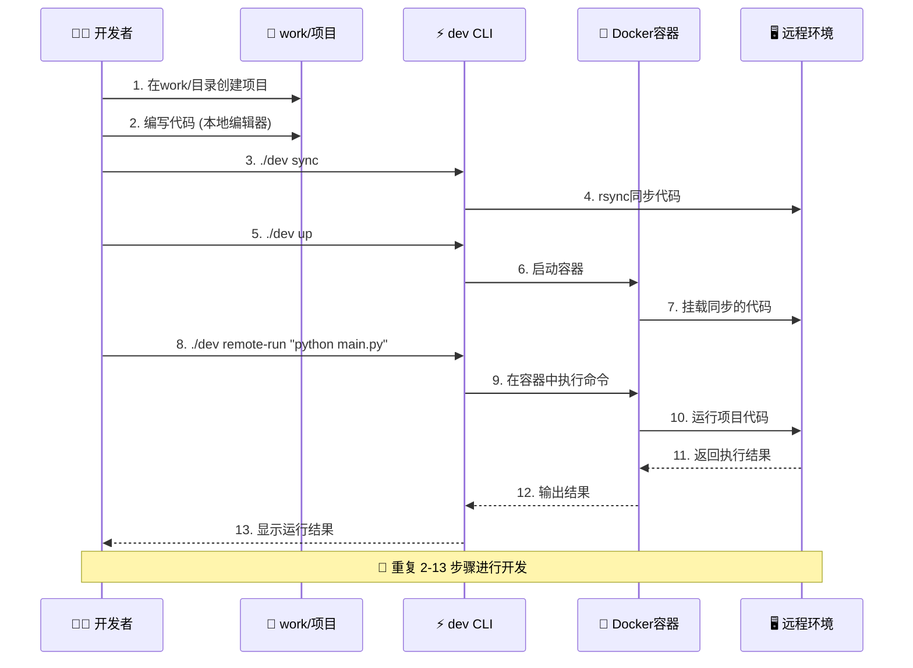

# 🚀 远程开发环境 - 终极精简版

> **极致简化，极速开发！** 本地编写代码，远程运行 - 一个工具，全部搞定 💫

**作者**: Zhang-Jingdian  
**邮箱**: 2157429750@qq.com  
**最终优化时间**: 2025年7月15日  
**版本**: v3.1.0 (本地挂载空间版) 🏆

[](https://opensource.org/licenses/MIT)
[](https://www.python.org)
[](https://vuejs.org)
[](.)

## ✨ 新功能：本地挂载空间

### 💡 **工作空间分离设计**

现在项目采用了更清晰的目录结构：

```
📦 workspace/ (工具本体)
├── 🛠️ main.py           # 工具源码 - 后端API服务
├── 💼 work/             # 🔥 你的工作空间 (在这里创建项目)
│   ├── 📖 README.md      
│   └── 📁 example-python-project/  # 示例项目
│       ├── main.py
│       ├── requirements.txt
│       └── README.md
├── ⚡ dev               # CLI工具
├── 🔧 config.env       # 配置文件
├── 🐳 docker/          # Docker配置目录
└── 🌐 web/             # Vue3前端
```

### 🎯 **核心理念：职责分离**

- **🛠️ `main.py`**: 工具的核心源代码，提供后端API服务 
- **💼 `/work`**: **你的本地挂载空间** - 在这里创建和管理你的项目
- **🔄 同步逻辑**: `work/` 目录自动同步到远程服务器，与工具源码完全分离

## 🏗️ 系统架构 & 工作流

### 📊 系统架构图



### 🔄 工作流程图



### 🎯 核心优势

- **🔧 零配置**: 一个config.env文件搞定所有配置
- **📁 分离设计**: 工具源码与用户项目完全分离  
- **⚡ 极速同步**: rsync增量同步，只传输变化文件
- **🐳 容器化**: Docker提供一致的远程运行环境
- **🌐 可视化**: Vue3 Web界面实时监控和管理
- **🧪 可靠性**: 完整测试套件确保工具稳定性

## 🚀 3分钟极速开始

### 1️⃣ 一键安装
```bash
# 克隆项目
git clone <repository-url>
cd workspace

# 安装依赖（只需要4个包！）
pip install -r requirements.txt

# 验证安装
python3 tests/test_dev.py
```

### 2️⃣ 极简配置
配置文件 `config.env` 已经设置好本地挂载空间：
```bash
# === 远程开发环境配置 ===
# 本地工作空间 (重点!)
LOCAL_PATH=./work

# 远程Docker主机
REMOTE_HOST=192.168.1.100
REMOTE_PATH=/home/zjd/workspace

# API服务端口
API_PORT=5000
```

### 3️⃣ 创建你的第一个项目
```bash
# 在work目录中创建项目
cd work
mkdir my-awesome-project
cd my-awesome-project

# 编写代码
echo "print('Hello from remote!')" > main.py

# 回到工具根目录
cd ../../

# 同步到远程
./dev sync

# 在远程Docker容器中运行
./dev remote-run python my-awesome-project/main.py
```

**🎉 完成！你的代码在远程运行了！**

## 🛠️ 核心命令（9个！）

```bash
./dev setup        # 初始化环境
./dev sync         # 同步work目录到远程
./dev watch        # 监控work目录变化
./dev up           # 启动远程Docker
./dev down         # 停止远程Docker
./dev status       # 查看运行状态
./dev logs         # 查看远程日志
./dev test         # 运行系统测试
./dev remote-run   # 🔥 在远程容器执行命令
```

## 💼 work目录工作流

### 🏗️ **项目结构**
```
work/                           # 你的本地挂载空间
├── project-a/                  # 项目A
│   ├── main.py
│   ├── requirements.txt
│   └── data/
├── project-b/                  # 项目B
│   ├── app.py
│   ├── models/
│   └── tests/
└── shared-utils/               # 共享工具
    ├── helpers.py
    └── configs/
```

### 🔄 **开发工作流**
```bash
# 1. 在work目录创建/编辑项目
cd work/my-project
vim main.py

# 2. 保存后自动同步 (如果开启了watch)
# 或手动同步
cd ../../
./dev sync

# 3. 远程执行
./dev remote-run python my-project/main.py

# 4. 安装远程依赖
./dev remote-run pip install -r my-project/requirements.txt

# 5. 交互式调试
./dev remote-run bash
```

## 🌟 示例项目体验

我们已经在 `work/example-python-project/` 创建了一个完整的示例项目：

```bash
# 体验示例项目
cd work/example-python-project
cat README.md  # 查看项目说明

# 运行示例 
cd ../../
./dev sync
./dev remote-run python example-python-project/main.py
```

## 🏗️ 项目结构（最终版）

```
📦 workspace/
├── 🛠️ main.py                  # 后端API服务 (316行)
├── 💼 work/                     # 🔥 本地挂载空间
│   ├── 📖 README.md             
│   └── 📁 example-python-project/   # 示例项目
├── 🌐 web/                     # Vue3前端
├── ⚡ dev                      # CLI工具 (9个命令)
├── 🔧 config.env               # 唯一配置文件
├── 🐳 docker/                  # Docker配置目录
│   ├── 🐳 docker-compose.yml   # Docker Compose配置
│   ├── 🐳 Dockerfile           # Docker镜像构建
│   └── 📋 requirements.txt     # Python依赖包
├── 🧪 tests/                   # 测试目录
│   └── 🧪 test_dev.py          # 测试套件
└── 📖 README.md               # 本文档
```

## 🚀 高级功能

### Web管理界面
```bash
# 启动后端API服务
python3 main.py

# 访问管理界面
open http://localhost:5000
```

### Vue3前端开发
```bash
cd web
npm install
npm run dev
```

### Docker化部署
```bash
# 一键启动完整环境
./dev up

# 查看运行状态
./dev status
```

## 🎯 性能特点

- **⚡ 超快启动**: 1秒启动，没有复杂初始化
- **📦 极小体积**: 核心代码<500行，依赖<10个包
- **🧠 零认知负担**: 工作空间分离，概念清晰
- **🔄 实时同步**: 文件变化立即同步，支持增量更新
- **📊 实时监控**: WebSocket实时推送系统状态
- **💼 本地挂载**: work目录专门用于用户项目

## 🧪 测试 & 验证

```bash
# 运行完整测试套件
./dev test

# 检查系统状态
./dev status

# 验证API服务
curl http://localhost:5000/api/health

# 测试示例项目
./dev remote-run python example-python-project/main.py
```

## 📈 优化哲学

> **"完美不是没有东西可以增加，而是没有东西可以减少"** - Antoine de Saint-Exupéry

这个项目遵循 **极简主义** 设计原则：

1. **分离 > 混合** - work目录专门用于用户项目
2. **简单 > 复杂** - 一个配置文件替代17个目录
3. **实用 > 炫技** - 每行代码都有存在价值
4. **快速 > 完美** - 5分钟上手胜过5小时研读

## 🆚 与其他方案对比

| 特性 | 本工具 | VSCode Remote | GitHub Codespaces |
|------|--------|---------------|-------------------|
| **配置复杂度** | 1个文件 | 多个配置文件 | 云端配置 |
| **工作空间管理** | 独立work目录 | 项目混合 | 云端管理 |
| **本地挂载** | ✅ work目录 | ❌ | ❌ |
| **启动时间** | <1秒 | 10-30秒 | 30-60秒 |
| **自定义能力** | 完全自由 | 有限制 | 平台限制 |
| **成本** | 免费 | 免费 | 付费 |
| **离线使用** | ✅ | ❌ | ❌ |

## 🔥 **新版本亮点**

### ✨ **v3.1.0 更新内容**

1. **🏗️ 工作空间分离**: `work/` 目录专门用于用户项目
2. **🔧 配置优化**: `LOCAL_PATH=./work` 默认挂载work目录
3. **🚀 新命令**: `./dev remote-run` 一键远程执行
4. **📁 示例项目**: 完整的Python示例展示工作流程
5. **🛡️ Git保护**: work目录内容不被Git跟踪 (除了README)

## 🤝 参与贡献

项目的核心哲学是 **保持简单**。如果你想贡献代码，请确保：

1. **不增加不必要的复杂度**
2. **保持work目录的纯净性**
3. **每个功能都有明确价值**
4. **保持代码精简可读**
5. **更新相应的测试**

## 📄 许可证

MIT License - 自由使用，自由修改

---

**🎉 享受极简而强大的远程开发体验！**

> 如果这个工具节省了你的时间，请给个 ⭐ Star 支持一下！

### 💡 **现在就开始**

```bash
# 创建你的第一个项目
cd work
mkdir my-first-remote-project
echo "print('Hello Remote World!')" > my-first-remote-project/main.py

# 同步并运行
cd ..
./dev sync
./dev remote-run python my-first-remote-project/main.py
```

**🚀 欢迎来到远程开发的新时代！** 