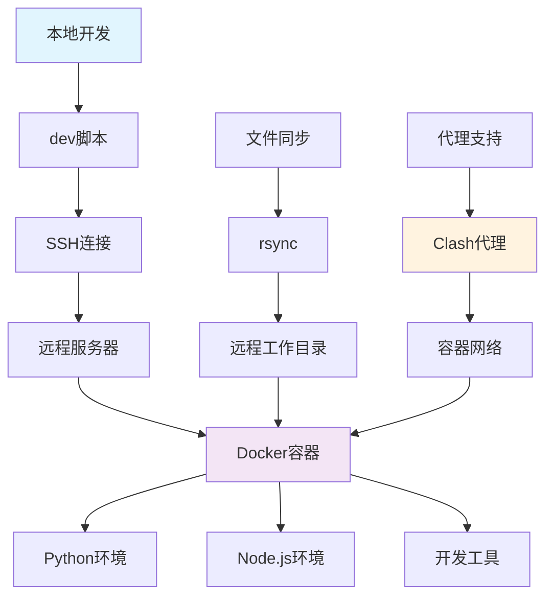
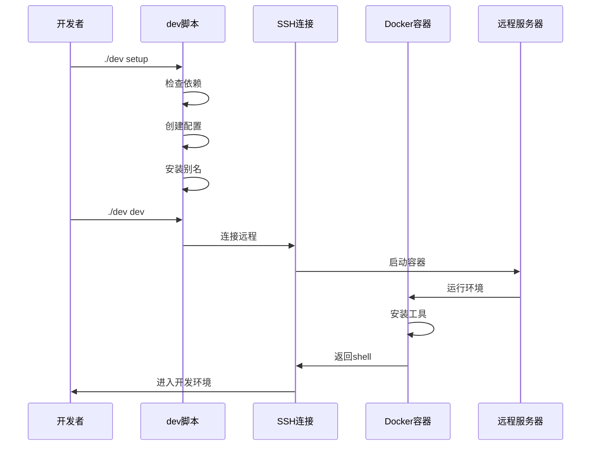

# 🚀 远程开发环境管理工具

一个简洁高效的远程开发环境管理工具，支持Python、Node.js等多种开发环境。

## ✨ 特性

- 🚀 **一键启动**: `./dev setup` 完成环境初始化
- 🐳 **Docker容器**: 隔离的开发环境，支持Python、Node.js
- 📁 **智能同步**: 自动同步本地代码到远程容器
- 💻 **交互式Shell**: 美观的远程开发终端
- 🧪 **内置测试**: 完整的系统测试套件
- 🎯 **智能检测**: 自动检测项目类型并安装对应依赖
- 🚀 **一键开发**: `./dev dev` 启动完整开发流程

## 🏗️ 架构图



## 🔄 工作流程



## 🚀 快速开始

### 1. 初始化环境
```bash
./dev setup
```

### 2. 一键开发模式
```bash
./dev dev
```

### 3. 传统方式
```bash
# 启动环境
dev up

# 进入开发
dev remote bash
```

## 📋 命令参考

| 命令 | 功能 | 示例 |
|------|------|------|
| `setup` | 初始化环境 | `./dev setup` |
| `dev` | 一键开发模式 | `./dev dev` |
| `up` | 启动容器 | `dev up` |
| `down` | 停止容器 | `dev down` |
| `remote` | 远程执行命令 | `dev remote bash` |
| `sync` | 同步文件 | `dev sync` |
| `status` | 查看状态 | `dev status` |
| `logs` | 查看日志 | `dev logs` |
| `test` | 运行测试 | `dev test` |

## 🛠️ 开发环境

容器内预装工具：
- **Python 3.11** + pip
- **Node.js 18** + npm
- **Git** + 常用开发工具
- **Vim/Nano** 编辑器
- **htop** 系统监控

## 📁 项目结构

```
workspace/
├── dev                    # 主CLI工具
├── config.env             # 配置文件
├── docker/                # Docker配置
│   ├── docker-compose.yml # 容器编排
│   ├── .remote_bashrc    # Shell配置
│   └── logs/             # 日志目录
├── work/                  # 工作空间
└── README.md             # 文档
```

## ⚙️ 配置

编辑 `config.env` 自定义配置：

```bash
# 远程服务器配置
REMOTE_HOST=192.168.0.105
REMOTE_USER=zjd
REMOTE_PATH=/home/zjd/workspace

# 本地配置
LOCAL_PATH=./work

# 同步配置
SYNC_EXCLUDE=".git,node_modules,*.log,*.tmp,.DS_Store,__pycache__"

# 端口配置
PYTHON_PORT=5000
NODE_PORT=3000
DJANGO_PORT=8000
DEBUG_PORT=9000

# 代理配置
HTTP_PROXY=socks5://127.0.0.1:7897
HTTPS_PROXY=socks5://127.0.0.1:7897
NO_PROXY=localhost,127.0.0.1
```

## 🔧 自定义开发环境

### 自定义Shell环境

编辑 `docker/.remote_bashrc`：

```bash
# 添加自定义别名
alias mytool='echo "Hello from remote!"'

# 设置环境变量
export MY_VAR="value"
```

## 📝 更新日志

### v5.0 (最新)
- 🚀 **全面优化**: 精简代码结构，提升性能
- 🎯 **一键开发**: 新增 `./dev dev` 命令，自动启动+同步+进入shell
- 📚 **文档升级**: 添加Mermaid架构图和工作流程图
- 🔧 **配置优化**: 支持自定义同步排除规则和端口配置
- 🧪 **测试增强**: 完整的系统测试套件
- 🎨 **界面美化**: 优化控制台输出，提升用户体验

### v4.4
- 🚀 **一键开发模式**: 新增 `./dev dev` 命令
- 🎯 **智能依赖检测**: 自动检测项目类型并安装对应依赖
- 📚 **配置优化**: 支持自定义同步排除规则和端口配置
- 🔧 **多端口支持**: 添加Node.js、Python Flask/Django端口映射
- 🧪 **部署模式**: 新增 `./dev deploy` 命令

## 📄 许可证

MIT License

## 👨‍💻 作者

Zhang-Jingdian (2157429750@qq.com)

---

🚀 **Happy Coding!** 享受高效的远程开发体验！
