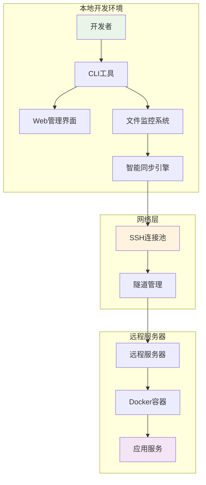

# 🚀 远程开发环境 - 企业级分布式开发平台

> 一个高度集成和优化的远程开发环境，提供本地编码、远程运行的无缝开发体验。通过统一的CLI工具，轻松管理代码同步、环境启停、日志查看等所有开发流程。

**作者**: Zhang-Jingdian  
**邮箱**: 2157429750@qq.com  
**创建时间**: 2025年7月14日  
**版本**: v1.0.0  

[](https://opensource.org/licenses/MIT)
[](https://www.gnu.org/software/bash/)
[](https://docs.docker.com/compose/)
[](http://localhost:8080)

## 🚀 快速开始

### 1. 环境准备
```bash
# 克隆项目
git clone <repository-url>
cd workspace

# 检查系统健康状态
./dev health

# 一键初始化环境
./dev setup
```

### 2. 基本配置
```bash
# 编辑核心配置
vim config/core/config.env

# 必需配置项：
SSH_ALIAS=your-remote-server
REMOTE_HOST=192.168.0.105
REMOTE_PROJECT_PATH=/home/user/workspace
```

### 3. 启动开发环境
```bash
# 启动文件监控和同步
./dev watch start

# 启动远程容器
./dev up

# 查看系统状态
./dev status

# 启动Web管理界面
./dev web start
# 访问: http://localhost:8080
```

## 🏗️ 系统架构



## 🌟 核心特性

### 🔄 智能同步系统
- **实时监控**: 自动检测文件变化
- **增量同步**: 只传输变更部分
- **防抖处理**: 避免频繁同步
- **冲突解决**: 智能处理文件冲突

### 🌐 网络管理
- **SSH连接池**: 复用连接，提升性能
- **隧道管理**: 安全的网络通道
- **代理配置**: 灵活的网络代理
- **负载均衡**: 多服务器支持

### 🐳 容器化环境
- **Docker集成**: 统一的运行环境
- **服务编排**: Docker Compose管理
- **镜像优化**: 多阶段构建
- **环境隔离**: 开发/测试/生产环境分离

### 🔒 安全增强
- **配置加密**: 敏感信息保护
- **访问控制**: 细粒度权限管理
- **安全审计**: 定期安全检查
- **密钥管理**: 自动化密钥轮换

### 📊 监控与优化
- **实时监控**: 系统资源和性能指标
- **告警通知**: 异常情况及时通知
- **性能优化**: 自动化性能调优
- **日志管理**: 集中化日志收集

## 📖 命令参考

### 核心命令
```bash
# 环境管理
./dev setup              # 一键设置开发环境
./dev up                 # 启动开发环境
./dev down               # 停止开发环境
./dev status             # 查看系统状态
./dev health             # 健康检查

# 代码同步
./dev sync               # 手动同步代码
./dev watch start        # 启动文件监控
./dev watch stop         # 停止文件监控
./dev watch status       # 监控状态

# 网络管理
./dev tunnel start       # 启动SSH隧道
./dev tunnel stop        # 停止SSH隧道
./dev pool init          # 初始化连接池
./dev pool status        # 连接池状态

# Web界面
./dev web start          # 启动Web管理界面
./dev web stop           # 停止Web管理界面
```

### 高级用法
```bash
# 调试模式
./dev --debug sync
./dev --verbose status

# 环境指定
./dev --env=production up
./dev --config=staging deploy

# 批量操作
./dev sync --exclude="*.log,*.tmp"
./dev watch start --interval=3
```

## 🛠️ 项目结构

```
workspace/
├── config/                    # 配置目录
│   ├── constants.sh          # 全局常量
│   ├── core/                 # 核心模块
│   │   ├── lib.sh           # 通用函数库
│   │   └── config.env       # 环境配置
│   ├── dev/                  # 开发工具
│   │   ├── cli.sh           # CLI主入口
│   │   ├── sync.sh          # 同步模块
│   │   ├── docker.sh        # Docker管理
│   │   └── watcher.sh       # 文件监控
│   ├── network/              # 网络模块
│   ├── security/             # 安全模块
│   ├── monitoring/           # 监控模块
│   ├── backup/              # 备份模块
│   ├── cluster/             # 集群管理
│   ├── plugins/             # 插件系统
│   ├── dynamic/             # 动态配置
│   ├── docker/              # Docker配置
│   ├── testing/             # 测试脚本
│   ├── deployment/          # 部署脚本
│   └── optimization/        # 优化脚本
├── web/                      # Web管理界面
│   ├── app.py               # Flask应用
│   ├── requirements.txt     # Python依赖
│   └── templates/           # 前端模板
├── src/                      # 应用源码
│   └── main.py              # 示例应用
├── docs/                     # 项目文档
├── logs/                     # 日志目录
├── dev -> config/dev/cli.sh  # CLI入口链接
└── README.md                 # 项目文档
```

## 🔧 详细配置

### 环境配置 (`config/core/config.env`)
```bash
# SSH连接配置
SSH_ALIAS=remote-server
REMOTE_HOST=192.168.0.105
REMOTE_PROJECT_PATH=/home/user/workspace

# Docker配置
DOCKER_SERVICE_NAME=web
DOCKER_HOST_PORT=8000

# 代理配置
REMOTE_DOCKER_PROXY=http://127.0.0.1:7897
LOCAL_PROXY_PORT=7897

# 项目配置
COMPOSE_PROJECT_NAME=workspace
DEBUG_MODE=false
```

### 集群配置 (`config/cluster/servers.yml`)
```yaml
servers:
  primary:
    host: 192.168.0.105
    port: 22
    user: zjd
    weight: 3
    role: primary
    
  backup:
    host: 192.168.0.106
    port: 22
    user: zjd
    weight: 2
    role: backup
```

## 🚨 故障排除

### 常见问题

#### SSH连接问题
```bash
# 检查SSH连接
./dev tunnel status
./dev pool status

# 测试连接
ssh -o ConnectTimeout=5 your-server 'echo "Connection OK"'
```

#### 同步失败
```bash
# 查看同步日志
./dev logs --grep="sync"

# 检查文件权限
./dev sync --check-permissions

# 重新初始化
./dev watch stop && ./dev watch start
```

#### 容器问题
```bash
# 查看容器状态
./dev docker status

# 重建容器
./dev docker rebuild

# 查看容器日志
./dev logs --container=web
```

## 📊 性能监控

### Web管理界面功能
- **📊 仪表板**: 系统概览和实时状态
- **⚙️ 配置管理**: 动态配置更新
- **🖥️ 集群管理**: 多服务器状态监控
- **🔌 插件管理**: 插件启用/禁用
- **📝 日志查看**: 实时日志和历史记录

### 系统指标监控
- CPU使用率、内存使用率、磁盘I/O
- 网络延迟、连接数量、同步速度
- 容器状态、服务健康度、错误率

## 🎯 最佳实践

### 开发流程建议
1. **环境隔离**: 使用不同配置区分环境
2. **版本控制**: 配置文件版本化管理
3. **监控优先**: 设置合理的监控和告警
4. **安全第一**: 定期安全审计和密钥更新
5. **文档维护**: 保持文档同步更新

### 性能优化
1. **网络优化**: 使用SSH连接池和压缩
2. **同步优化**: 设置合理的排除规则
3. **资源监控**: 定期检查系统资源使用
4. **容器优化**: 使用多阶段构建减少镜像大小

## 🤝 贡献指南

欢迎贡献代码、报告问题或提出改进建议！

### 开发环境搭建
```bash
# 1. Fork 项目并克隆
git clone https://github.com/your-username/remote-dev-env.git

# 2. 安装依赖
./dev setup

# 3. 运行测试
./config/testing/test_runner.sh

# 4. 启动开发环境
./dev up --env=development
```

### 提交流程
1. 创建功能分支
2. 编写代码和测试
3. 运行完整测试套件
4. 提交Pull Request
5. 代码审查和合并

## 📄 许可证

本项目采用 MIT 许可证 - 详见 [LICENSE](LICENSE) 文件

## 👨‍💻 作者信息

**Zhang-Jingdian**  
- 📧 邮箱: 2157429750@qq.com  
- 🐱 GitHub: [@Zhang-Jingdian](https://github.com/Zhang-Jingdian)  
- 📅 创建时间: 2025年7月14日  

## 🙏 致谢

感谢所有贡献者和开源社区的支持！

---

**© 2025 Zhang-Jingdian. All rights reserved.**

---

> 🚀 **让远程开发变得简单高效！**
> 
> 如果这个项目对你有帮助，请给个 ⭐️ 支持一下！ 