# 🚀 远程开发环境管理工具

[](LICENSE)
[](.)
[](https://python.org)

> 一个简洁高效的远程开发环境管理工具，支持文件同步和Docker容器管理。

## ✨ 核心特性

- 🚀 **一键环境管理** - 简单命令启动/停止远程开发环境
- 🔄 **智能文件同步** - 自动同步本地代码到远程服务器
- 🐳 **Docker集成** - 统一的容器化开发环境
- 💻 **交互式Shell** - 美观的远程命令行界面
- ⚡ **高性能** - 优化的同步算法和精简的容器镜像

## 🏗️ 系统架构

```mermaid
graph TB
    subgraph "本地环境"
        A[开发者] --> B[./dev CLI工具]
        B --> C[文件监控]
        C --> E[本地代码<br/>work/]
    end
    
    subgraph "网络传输"
        F[rsync + SSH]
    end
    
    subgraph "远程服务器"
        G[远程文件系统<br/>/home/zjd/workspace]
        H[Docker容器<br/>remote-dev-env]
        I[开发环境<br/>Python/Node.js/Git]
    end
    
    E -->|同步| F
    F -->|传输| G
    G -->|挂载| H
    H --> I
    
    B -->|SSH| H
    
    style A fill:#e1f5fe
    style B fill:#f3e5f5
    style H fill:#e8f5e8
    style I fill:#fff3e0
```



## 📋 工作流程

```mermaid
sequenceDiagram
    participant Dev as 开发者
    participant CLI as ./dev CLI
    participant Remote as 远程服务器
    participant Docker as Docker容器
    
    Dev->>CLI: ./dev setup
    CLI->>CLI: 检查依赖和配置
    
    Dev->>CLI: ./dev up
    CLI->>Remote: SSH连接
    CLI->>Docker: 启动容器
    
    Dev->>CLI: 编辑本地代码
    CLI->>Remote: rsync同步文件
    Remote->>Docker: 挂载更新文件
    
    Dev->>CLI: ./dev remote-run bash
    CLI->>Docker: 交互式Shell
    Docker-->>Dev: 美观的命令提示符
    
    Dev->>CLI: ./dev logs
    CLI->>Docker: 获取日志
    Docker-->>Dev: 实时日志输出
```



## 🚀 快速开始

### 1. 环境要求

- **Docker** 和 docker-compose
- **SSH** 访问远程服务器
- **rsync** (macOS内置)
- **Python 3.9+** (可选)

### 2. 一键安装

```bash
# 克隆项目
git clone <your-repo-url>
cd remote-dev-tool

# 初始化环境
./dev setup

# 编辑配置文件
vim config.env
```

### 3. 配置文件 (`config.env`)

```bash
# 远程服务器配置
REMOTE_HOST=192.168.0.105
REMOTE_USER=zjd
REMOTE_PATH=/home/zjd/workspace

# 本地配置
LOCAL_PATH=./work
```

### 4. 启动环境

```bash
# 启动远程Docker环境
./dev up

# 查看状态
./dev status

# 进入交互式开发环境
./dev remote-run bash
```

## 📖 命令参考

### 核心命令

| 命令 | 功能 | 示例 |
|------|------|------|
| `setup` | 初始化环境 | `./dev setup` |
| `up` | 启动Docker容器 | `./dev up` |
| `down` | 停止Docker容器 | `./dev down` |
| `status` | 查看运行状态 | `./dev status` |
| `sync` | 手动同步文件 | `./dev sync` |
| `remote-run` | 执行远程命令 | `./dev remote-run "python3 main.py"` |

### 开发命令

| 命令 | 功能 | 示例 |
|------|------|------|
| `watch` | 监控文件变化 | `./dev watch` |
| `logs` | 查看实时日志 | `./dev logs` |

| `test` | 运行系统测试 | `./dev test` |

## 💻 使用示例

### 基础开发流程

```bash
# 1. 启动环境
./dev up

# 2. 编辑代码（本地）
echo "print('Hello Remote!')" > work/my-project/hello.py

# 3. 同步并运行（远程）
./dev remote-run "python3 work/my-project/hello.py"

# 4. 进入交互式开发
./dev remote-run bash
```

### 交互式Shell特性

进入远程Shell后，您将看到：

```bash
🚀 欢迎进入远程Docker开发环境！
📁 工作目录: /workspace
💡 你的本地代码已同步到此容器中

🐳 remote-dev:/workspace$ 
```

内置便捷别名：
- `ll` - 详细文件列表
- `py` - Python3快捷方式
- `c` - 清屏
- `..` - 返回上级目录

## 🎨 项目结构

```
remote-dev-tool/
├── dev                    # 主CLI工具
├── config.env             # 配置文件
├── docker/                # Docker配置
│   ├── Dockerfile         # 容器镜像
│   ├── docker-compose.yml # 容器编排
│   ├── .remote_bashrc     # 完整版Shell配置
│   └── .remote_bashrc_simple # 简化版Shell配置
├── work/                  # 用户工作空间
│   └── README.md
└── README.md             # 项目文档
```

## ⚡ 性能优化

### 同步优化
- 智能排除模式，减少不必要文件传输
- 增量同步，只传输变更文件
- 压缩传输，节省网络带宽

### 容器优化
- 精简Docker镜像，快速启动
- 优化资源配置，降低内存占用
- 智能重启策略，提高稳定性

## 🛠️ 高级配置

### 自定义Shell环境

编辑 `docker/.remote_bashrc` 来自定义您的远程Shell环境：

```bash
# 添加自定义别名
alias mycommand='echo "Hello World"'

# 设置环境变量
export MY_VAR="value"

# 添加自定义函数
function myfunction() {
    echo "Custom function"
}
```

### 文件监控

启用实时文件监控（需要安装fswatch）：

```bash
# macOS
brew install fswatch

# 启动监控
./dev watch
```

## 🔧 故障排除

### 常见问题

**Q: 容器启动失败**
```bash
# 检查Docker状态
docker ps -a

# 查看容器日志
./dev logs

# 重启容器
./dev down && ./dev up
```

**Q: 文件同步失败**
```bash
# 检查SSH连接
ssh 192.168.0.105

# 手动同步测试
./dev sync
```

**Q: 网络连接问题**
```bash
# 检查网络连通性
ping 192.168.0.105

# 测试系统
./dev test
```

## 📝 更新日志

### v4.0 (2025-07-15)
- 🚀 全面重构，提升性能和用户体验
- ✨ 新增美观的交互式Shell界面
- 🔧 优化文件同步算法
- 📚 更新文档和架构图

### v3.1 (2025-07-14)
- 🐳 Docker容器集成

- 📁 智能文件同步

## 📄 许可证

本项目采用 MIT 许可证 - 查看 [LICENSE](LICENSE) 文件了解详情。

## 👨‍💻 作者

**Zhang-Jingdian**
- 📧 Email: 2157429750@qq.com
- 🚀 Version: v4.0

---

> 💡 **提示**: 如需帮助或有任何问题，请查看故障排除部分或提交Issue。
