# 🔌 API文档

> 远程开发环境的完整API参考文档，包含Web API和CLI API

## 🌐 Web API

### API架构

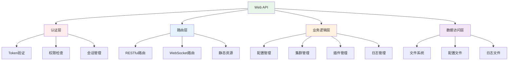

### API端点总览

```mermaid
mindmap
  root((API端点))
    认证相关
      POST /api/auth/login
      POST /api/auth/logout
      GET /api/auth/status
    配置管理
      GET /api/config
      POST /api/config
      PUT /api/config/{key}
      DELETE /api/config/{key}
    集群管理
      GET /api/cluster/status
      POST /api/cluster/health-check
      PUT /api/cluster/server/{id}
    插件管理
      GET /api/plugins
      POST /api/plugins/{name}/toggle
      GET /api/plugins/{name}/config
    监控相关
      GET /api/metrics
      GET /api/logs
      WebSocket /ws/realtime
```

### 认证API

#### 登录认证

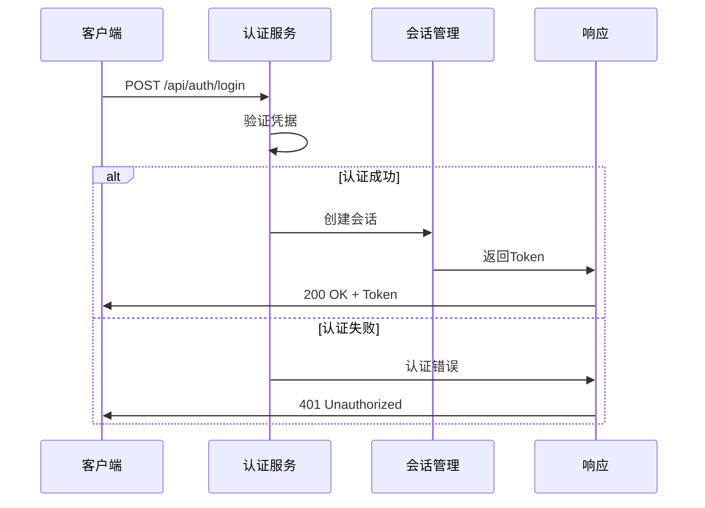

**接口详情:**
- **URL**: `POST /api/auth/login`
- **请求体**:
```json
{
  "username": "admin",
  "password": "password123"
}
```
- **响应**:
```json
{
  "status": "success",
  "token": "eyJhbGciOiJIUzI1NiIsInR5cCI6IkpXVCJ9...",
  "expires_in": 3600
}
```

### 配置管理API

#### 获取配置

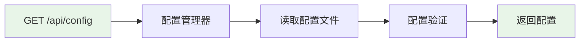

**接口详情:**
- **URL**: `GET /api/config`
- **响应**:
```json
{
  "ssh_alias": "remote-server",
  "remote_host": "192.168.0.105",
  "remote_project_path": "/home/user/workspace",
  "docker_service_name": "web",
  "debug_mode": false
}
```

#### 更新配置

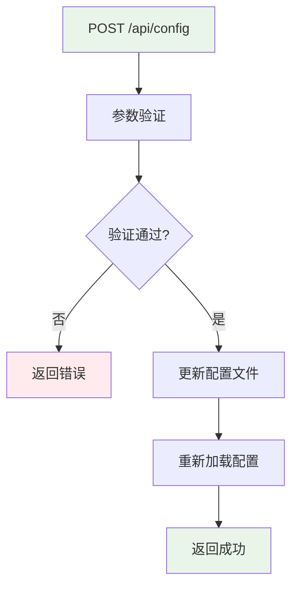

### 集群管理API

#### 集群状态

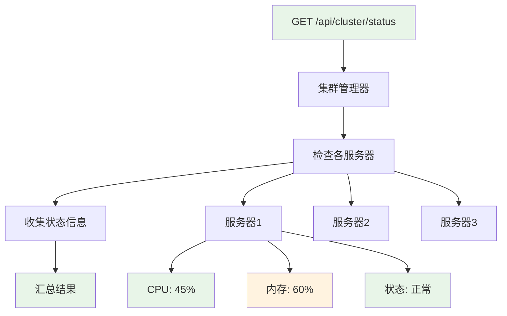

**响应格式:**
```json
{
  "cluster_status": "healthy",
  "servers": [
    {
      "id": "primary",
      "host": "192.168.0.105",
      "status": "online",
      "cpu_usage": 45.2,
      "memory_usage": 60.1,
      "disk_usage": 35.8,
      "last_check": "2024-07-14T06:30:00Z"
    }
  ]
}
```

### 插件管理API

#### 插件列表

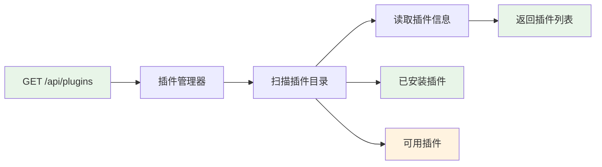

#### 插件切换

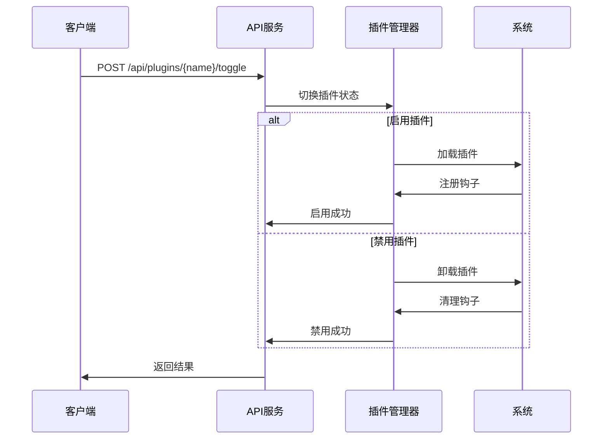

### 监控API

#### 系统指标

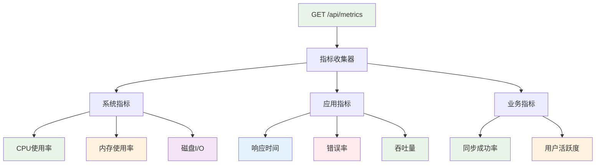

### WebSocket API

#### 实时通信

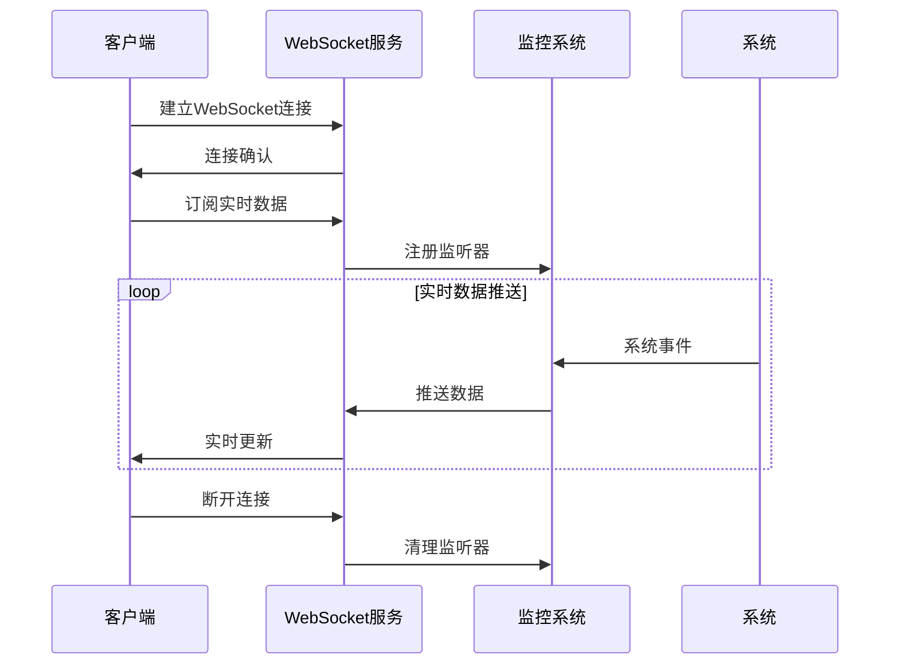

**WebSocket消息格式:**
```json
{
  "type": "metrics_update",
  "timestamp": "2024-07-14T06:30:00Z",
  "data": {
    "cpu_usage": 45.2,
    "memory_usage": 60.1,
    "active_connections": 12
  }
}
```

## 🖥️ CLI API

### CLI架构

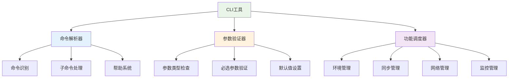

### 命令分类

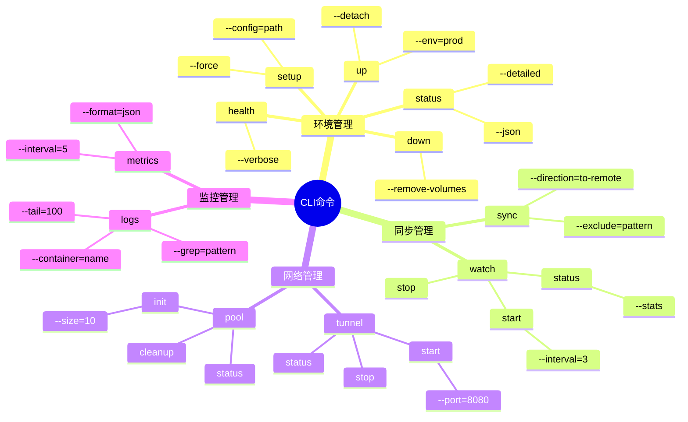

### 命令执行流程

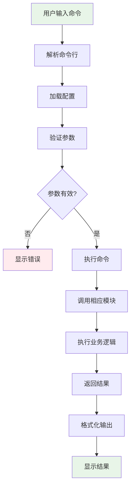

### 环境管理命令

#### setup命令

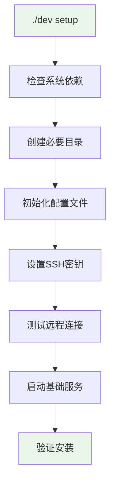

**命令格式:**
```bash
./dev setup [OPTIONS]

OPTIONS:
  --force              强制重新初始化
  --config=PATH        指定配置文件路径
  --ssh-key=PATH       指定SSH密钥路径
  --remote-host=HOST   指定远程主机
  --help               显示帮助信息
```

#### status命令

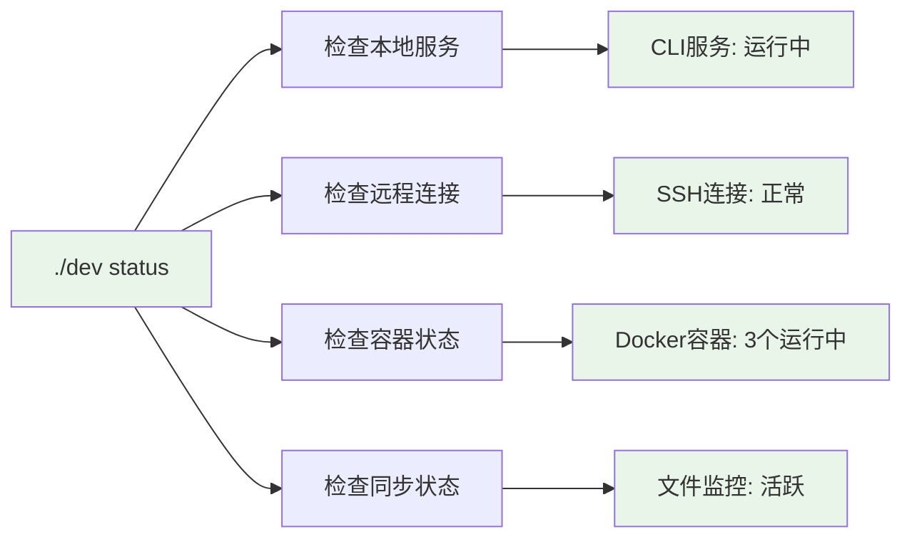

### 同步管理命令

#### sync命令

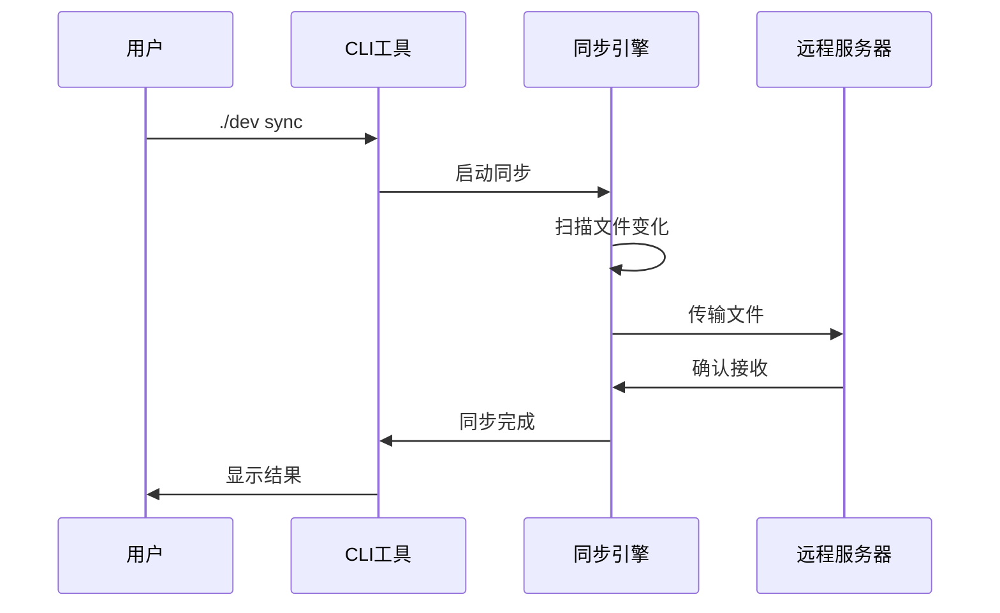

**命令格式:**
```bash
./dev sync [OPTIONS]

OPTIONS:
  --direction=DIRECTION    同步方向 (to-remote|from-remote|bidirectional)
  --exclude=PATTERN        排除文件模式
  --dry-run               预览模式，不实际同步
  --verbose               详细输出
  --force                 强制同步
```

### 网络管理命令

#### tunnel命令

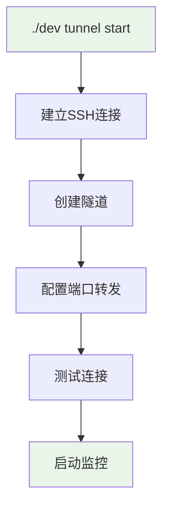

### 错误处理

#### 错误分类

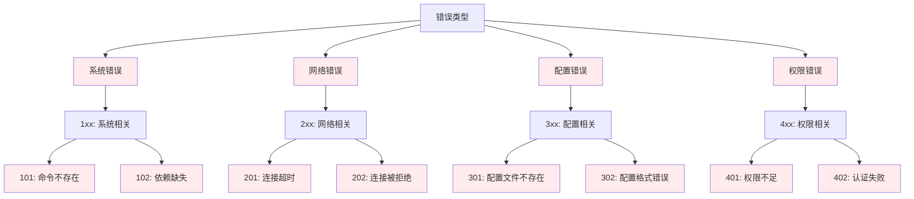

#### 错误处理流程

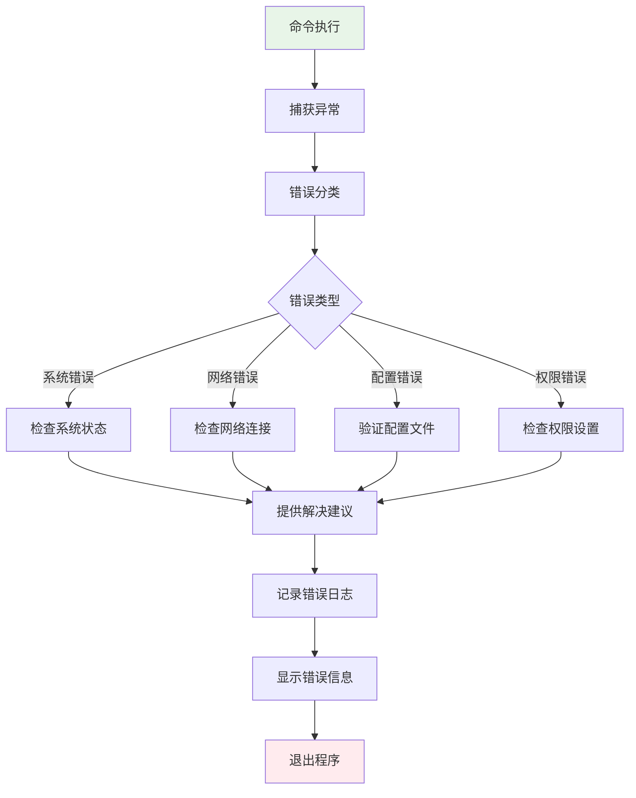

## 📊 API监控

### 性能指标

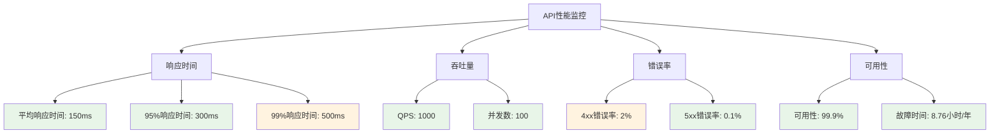

### 监控告警

```mermaid
sequenceDiagram
    participant API as API服务
    participant Monitor as 监控系统
    participant Alert as 告警系统
    participant Admin as 管理员
    
    API->>Monitor: 上报指标
    Monitor->>Monitor: 检查阈值
    
    alt 超过阈值
        Monitor->>Alert: 触发告警
        Alert->>Admin: 发送通知
        Admin->>API: 处理问题
    else 正常范围
        Monitor->>Monitor: 继续监控
    end
```

## 🔗 SDK和客户端

### Python SDK

```python
from remote_dev_env import RemoteDevEnvClient

# 创建客户端
client = RemoteDevEnvClient(
    base_url="http://localhost:8080",
    api_key="your-api-key"
)

# 获取集群状态
cluster_status = client.cluster.get_status()

# 同步文件
sync_result = client.sync.sync_files(
    direction="to-remote",
    exclude=["*.log", "*.tmp"]
)

# 获取实时指标
def on_metrics(data):
    print(f"CPU: {data['cpu_usage']}%")

client.realtime.subscribe("metrics", on_metrics)
```

### JavaScript SDK

```javascript
import { RemoteDevEnvClient } from '@remote-dev-env/client';

const client = new RemoteDevEnvClient({
  baseUrl: 'http://localhost:8080',
  apiKey: 'your-api-key'
});

// 获取配置
const config = await client.config.get();

// 更新配置
await client.config.update({
  debug_mode: true
});

// WebSocket连接
const ws = client.realtime.connect();
ws.on('metrics', (data) => {
  console.log('Metrics:', data);
});
```

### Vue3 SDK

```vue
<template>
  <div class="remote-dev-dashboard">
    <h1>远程开发环境管理</h1>
    
    <!-- 系统指标 -->
    <el-row :gutter="20">
      <el-col :span="6" v-for="metric in metrics" :key="metric.name">
        <el-card>
          <div class="metric-card">
            <div class="metric-value">{{ metric.value }}</div>
            <div class="metric-label">{{ metric.label }}</div>
          </div>
        </el-card>
      </el-col>
    </el-row>
    
    <!-- 实时连接状态 -->
    <el-tag :type="systemStore.connected ? 'success' : 'danger'">
      {{ systemStore.connected ? '已连接' : '未连接' }}
    </el-tag>
  </div>
</template>

<script setup>
import { ref, onMounted } from 'vue'
import { useSystemStore } from '@/stores/system'

const systemStore = useSystemStore()
const metrics = ref([
  { name: 'cpu', label: 'CPU使用率', value: '0%' },
  { name: 'memory', label: '内存使用率', value: '0%' },
  { name: 'disk', label: '磁盘使用率', value: '0%' },
  { name: 'connections', label: '活跃连接', value: '0' }
])

// 获取系统指标
const fetchMetrics = async () => {
  await systemStore.fetchMetrics()
  
  metrics.value = [
    { name: 'cpu', label: 'CPU使用率', value: `${systemStore.metrics.cpuUsage.toFixed(1)}%` },
    { name: 'memory', label: '内存使用率', value: `${systemStore.metrics.memoryUsage.toFixed(1)}%` },
    { name: 'disk', label: '磁盘使用率', value: `${systemStore.metrics.diskUsage.toFixed(1)}%` },
    { name: 'connections', label: '活跃连接', value: systemStore.metrics.activeConnections.toString() }
  ]
}

// 更新配置
const updateConfig = async (key, value) => {
  try {
    const response = await axios.post('/api/config', { key, value })
    if (response.data.success) {
      ElMessage.success('配置更新成功')
    }
  } catch (error) {
    ElMessage.error('配置更新失败')
  }
}

onMounted(() => {
  // 初始化WebSocket连接
  systemStore.initWebSocket()
  
  // 获取初始数据
  fetchMetrics()
  
  // 定期刷新数据
  setInterval(fetchMetrics, 5000)
})
</script>

<style scoped>
.metric-card {
  text-align: center;
  padding: 20px;
}

.metric-value {
  font-size: 24px;
  font-weight: bold;
  color: #409EFF;
}

.metric-label {
  font-size: 14px;
  color: #909399;
  margin-top: 8px;
}
</style>
```

### Pinia Store 使用示例

```javascript
// stores/system.js
import { defineStore } from 'pinia'
import { io } from 'socket.io-client'
import axios from 'axios'

export const useSystemStore = defineStore('system', {
  state: () => ({
    connected: false,
    metrics: {
      cpuUsage: 0,
      memoryUsage: 0,
      diskUsage: 0,
      activeConnections: 0
    },
    config: {},
    socket: null
  }),

  actions: {
    // 初始化WebSocket连接
    initWebSocket() {
      this.socket = io('ws://localhost:8080')
      
      this.socket.on('connect', () => {
        this.connected = true
      })
      
      this.socket.on('metrics_updated', (data) => {
        this.metrics = { ...this.metrics, ...data }
      })
    },

    // 获取系统指标
    async fetchMetrics() {
      try {
        const response = await axios.get('/api/metrics')
        this.metrics = response.data
      } catch (error) {
        console.error('获取指标失败:', error)
      }
    }
  }
})
```

## 🔗 相关资源

- [用户手册](../user/README.md) - 基础使用指南
- [开发指南](../development/README.md) - 开发者文档
- [部署指南](../deployment/README.md) - 部署操作手册
- [故障排除](../troubleshooting/README.md) - 问题解决方案

---

> 🔌 **API文档**: 本文档提供了完整的API参考，包含所有接口的详细说明和示例代码！ 