# 🚀 部署指南

> 远程开发环境的完整部署手册，从开发环境到生产环境的全流程指导

## 📋 部署概览

### 部署架构

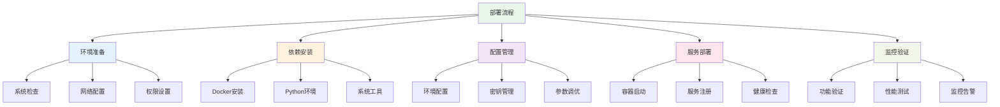

### 部署环境分类

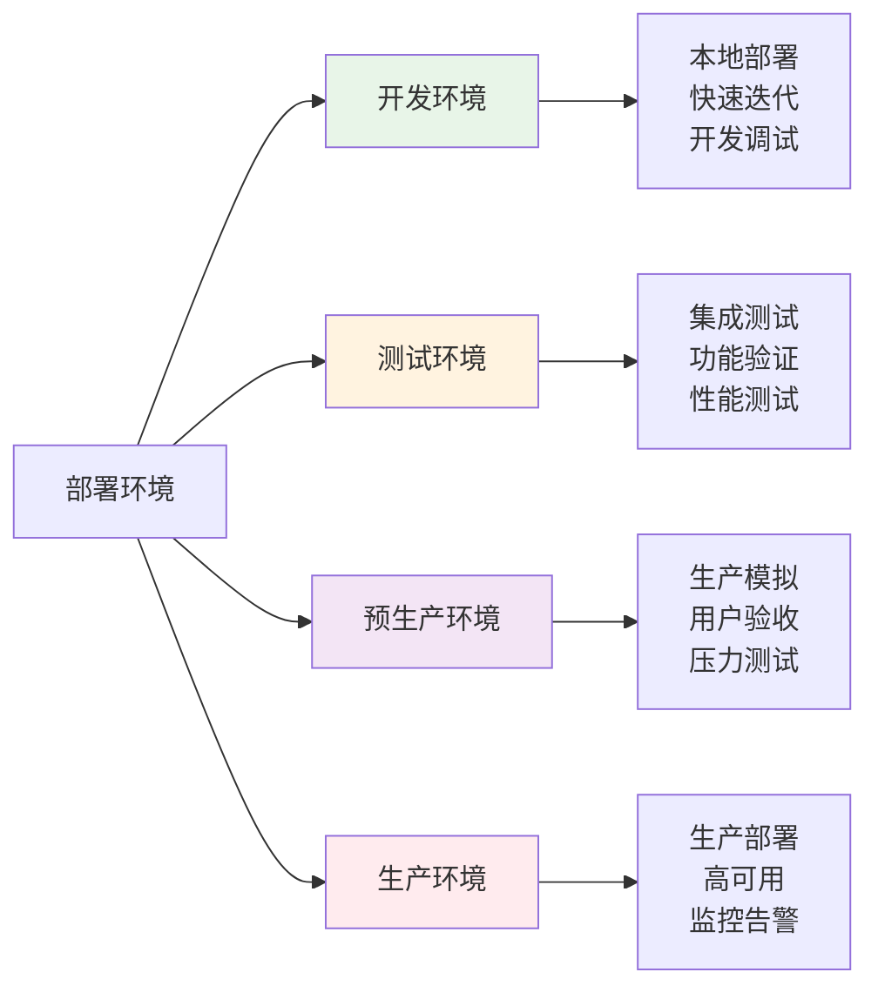

## 🛠️ 环境准备

### 系统要求

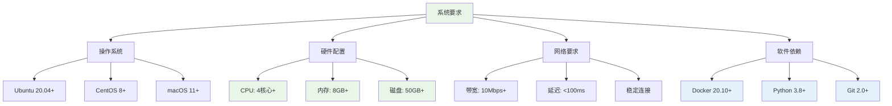

### 环境检查脚本

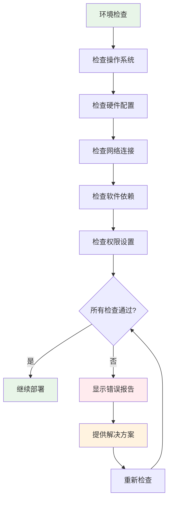

## 🐳 容器化部署

### Docker部署架构

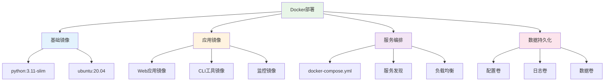

### 容器构建流程

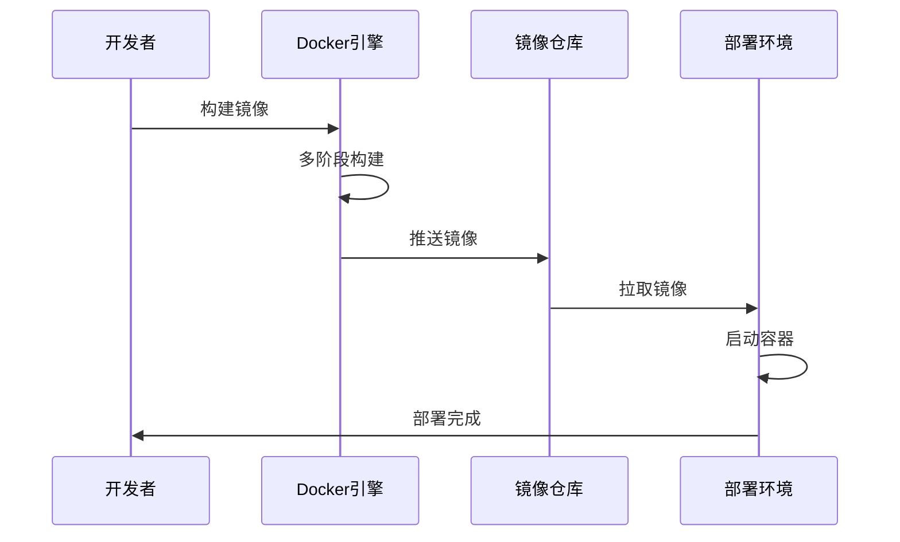

### Docker Compose配置

```yaml
version: '3.8'

services:
  web:
    build:
      context: .
      dockerfile: config/docker/Dockerfile
      target: production
    ports:
      - "8080:8080"
    environment:
      - FLASK_ENV=production
      - DEBUG_MODE=false
    volumes:
      - ./logs:/app/logs
      - ./config:/app/config:ro
    depends_on:
      - redis
    restart: unless-stopped
    
  redis:
    image: redis:7-alpine
    ports:
      - "6379:6379"
    volumes:
      - redis_data:/data
    restart: unless-stopped
    
  nginx:
    image: nginx:alpine
    ports:
      - "80:80"
      - "443:443"
    volumes:
      - ./nginx.conf:/etc/nginx/nginx.conf:ro
      - ./ssl:/etc/nginx/ssl:ro
    depends_on:
      - web
    restart: unless-stopped

volumes:
  redis_data:
```

## 🌍 多环境部署

### 环境配置管理

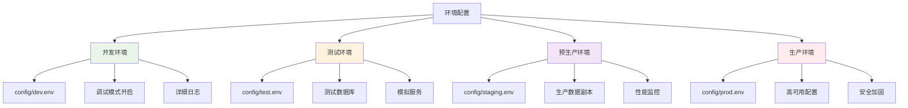

### 环境切换流程

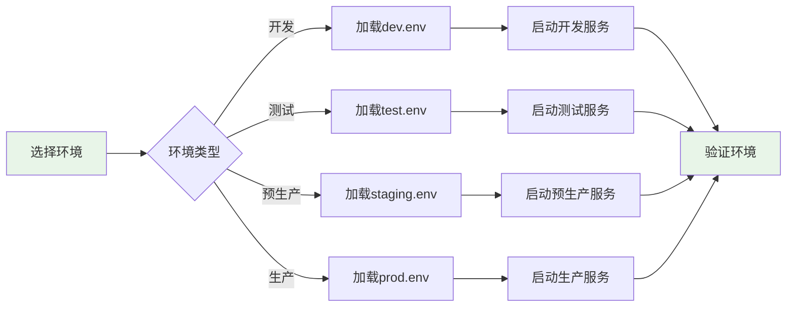

## 🔄 自动化部署

### CI/CD流水线

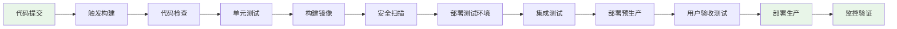

### GitHub Actions配置

```yaml
name: Deploy Remote Dev Environment

on:
  push:
    branches: [main]
  pull_request:
    branches: [main]

jobs:
  test:
    runs-on: ubuntu-latest
    steps:
      - uses: actions/checkout@v3
      - name: Set up Python
        uses: actions/setup-python@v4
        with:
          python-version: '3.11'
      - name: Install dependencies
        run: |
          pip install -r requirements.txt
      - name: Run tests
        run: |
          ./config/testing/test_runner.sh
          
  build:
    needs: test
    runs-on: ubuntu-latest
    steps:
      - uses: actions/checkout@v3
      - name: Build Docker image
        run: |
          docker build -t remote-dev-env:latest .
      - name: Push to registry
        run: |
          docker push remote-dev-env:latest
          
  deploy:
    needs: build
    runs-on: ubuntu-latest
    if: github.ref == 'refs/heads/main'
    steps:
      - name: Deploy to production
        run: |
          ./config/deployment/deploy.sh --env=production
```

### 部署脚本架构

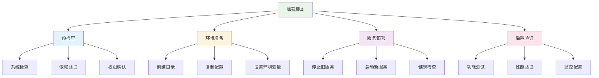

## 🔧 配置管理

### 配置文件结构

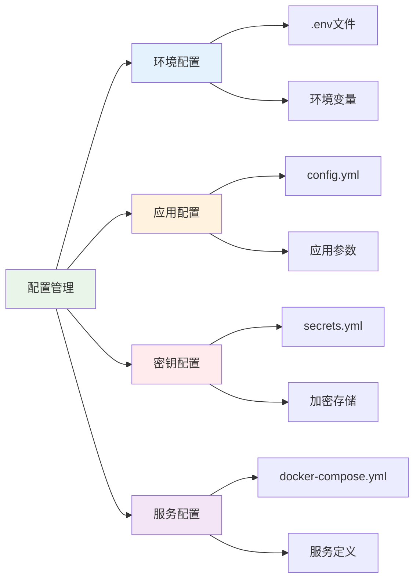

### 配置加密流程

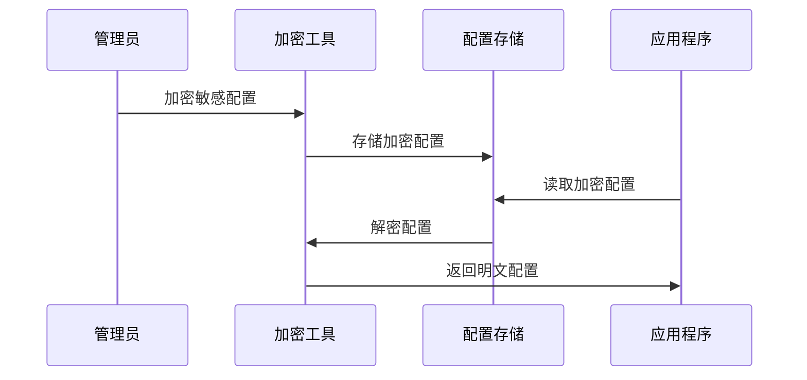

## 🚀 生产部署

### 高可用架构

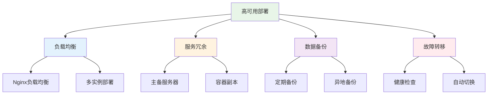

### 部署拓扑图

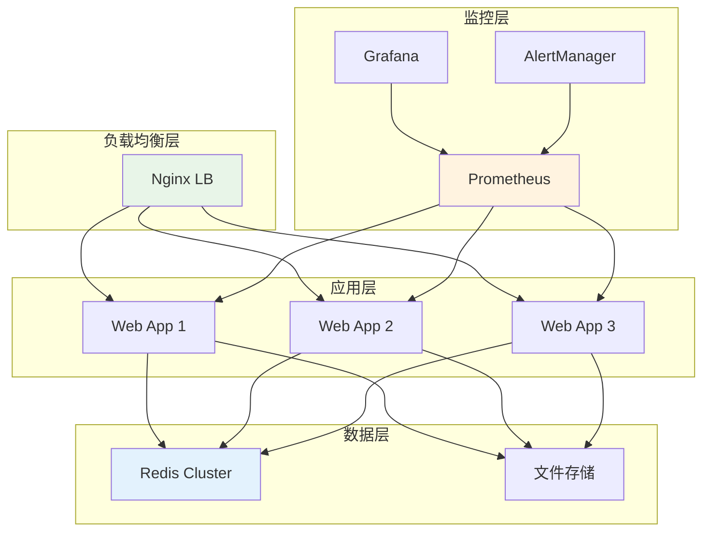

## 🔍 部署验证

### 验证流程

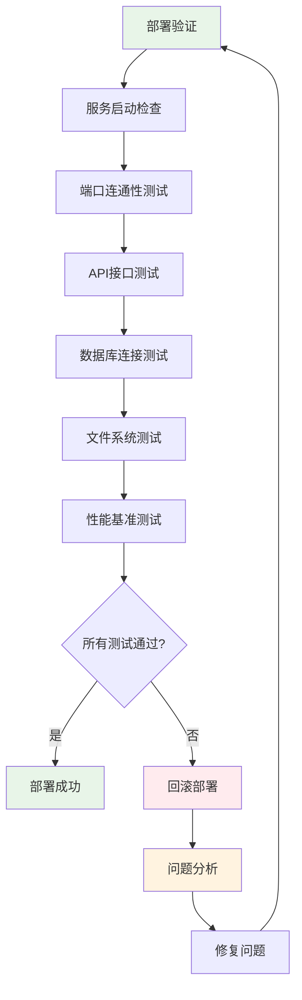

### 健康检查

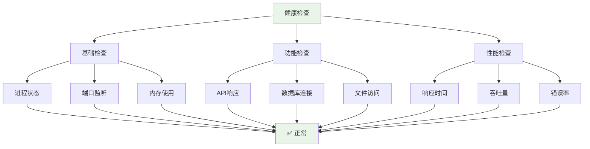

## 📊 监控部署

### 监控架构

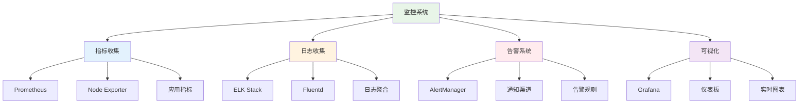

### 监控部署流程

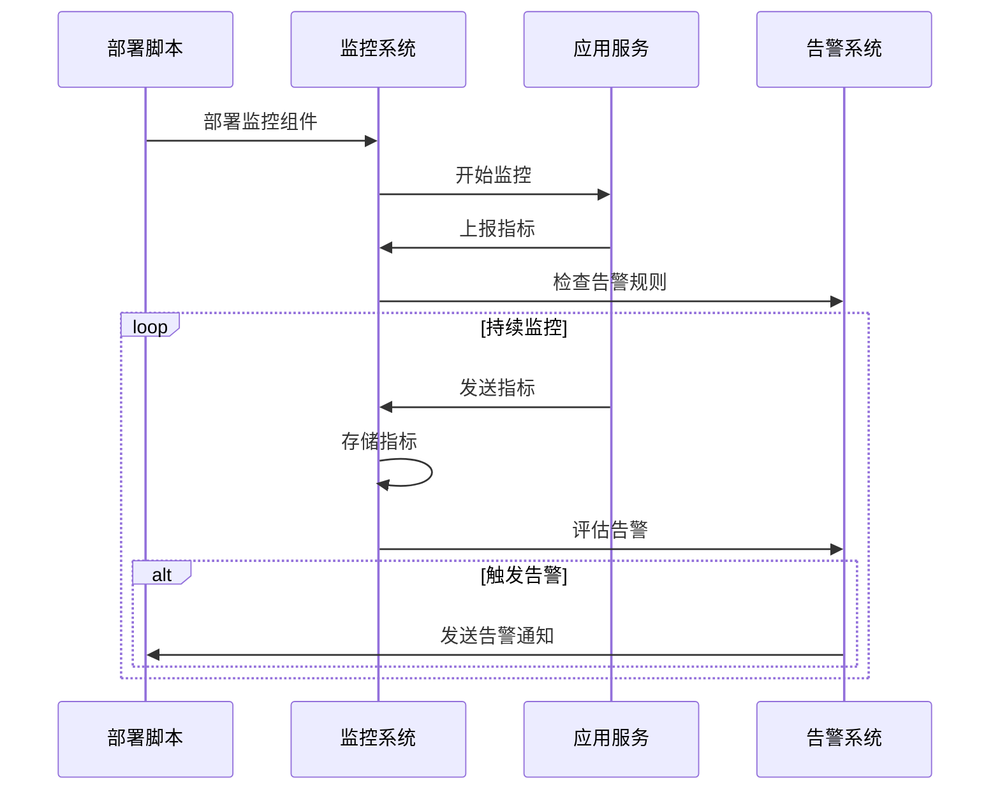

## 🔧 故障处理

### 故障分类

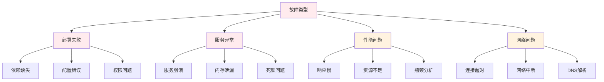

### 故障恢复流程

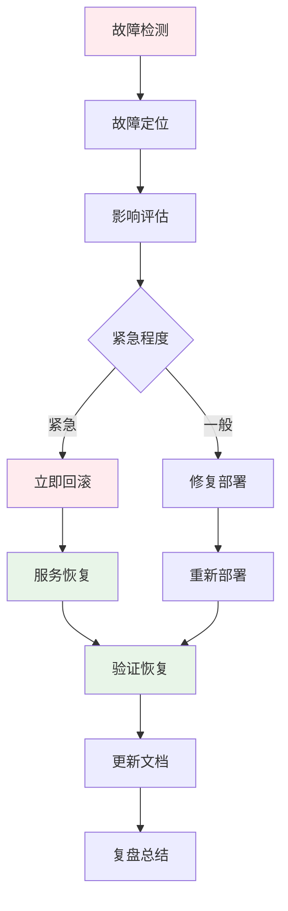

## 🛡️ 安全部署

### 安全检查清单

```mermaid
mindmap
  root((安全检查))
    网络安全
      防火墙配置
      端口限制
      SSL证书
      VPN访问
    应用安全
      输入验证
      身份认证
      权限控制
      会话管理
    数据安全
      数据加密
      备份策略
      访问日志
      审计追踪
    系统安全
      系统更新
      漏洞扫描
      病毒防护
      入侵检测
```

### 安全部署流程

```mermaid
sequenceDiagram
    participant Security as 安全团队
    participant Deploy as 部署团队
    participant System as 系统
    participant Monitor as 监控系统
    
    Security->>Deploy: 安全要求
    Deploy->>System: 安全配置
    System->>Monitor: 启动安全监控
    Monitor->>Security: 安全报告
    
    loop 持续安全监控
        Monitor->>Monitor: 安全扫描
        Monitor->>Security: 异常告警
        Security->>Deploy: 安全修复
        Deploy->>System: 应用补丁
    end
```

## 📈 性能优化

### 性能调优

```mermaid
graph TB
    A[性能优化] --> B[应用层优化]
    A --> C[系统层优化]
    A --> D[网络层优化]
    A --> E[存储层优化]
    
    B --> F[代码优化]
    B --> G[缓存策略]
    B --> H[连接池]
    
    C --> I[系统参数]
    C --> J[资源分配]
    C --> K[进程调度]
    
    D --> L[带宽优化]
    D --> M[延迟优化]
    D --> N[负载均衡]
    
    E --> O[磁盘I/O]
    E --> P[数据库优化]
    E --> Q[文件系统]
    
    style A fill:#e8f5e8
    style B fill:#e3f2fd
    style C fill:#fff3e0
    style D fill:#f3e5f5
    style E fill:#fce4ec
```

### 性能监控指标

```mermaid
graph LR
    A[性能指标] --> B[响应时间]
    A --> C[吞吐量]
    A --> D[资源使用率]
    A --> E[错误率]
    
    B --> F[< 200ms]
    C --> G[> 1000 QPS]
    D --> H[< 80%]
    E --> I[< 0.1%]
    
    style F fill:#e8f5e8
    style G fill:#e8f5e8
    style H fill:#e8f5e8
    style I fill:#e8f5e8
```

## 🔗 相关资源

- [用户手册](../user/README.md) - 基础使用指南
- [开发指南](../development/README.md) - 开发者文档
- [API文档](../api/README.md) - 接口详细说明
- [故障排除](../troubleshooting/README.md) - 问题解决方案

---

> 🚀 **部署指南**: 这份指南涵盖了从开发到生产的完整部署流程，确保系统稳定可靠运行！ 