# 👨‍💻 开发指南

> 面向开发者的深度技术文档，包含架构设计、代码规范、扩展开发等内容

## 🏗️ 系统架构

### 整体架构设计

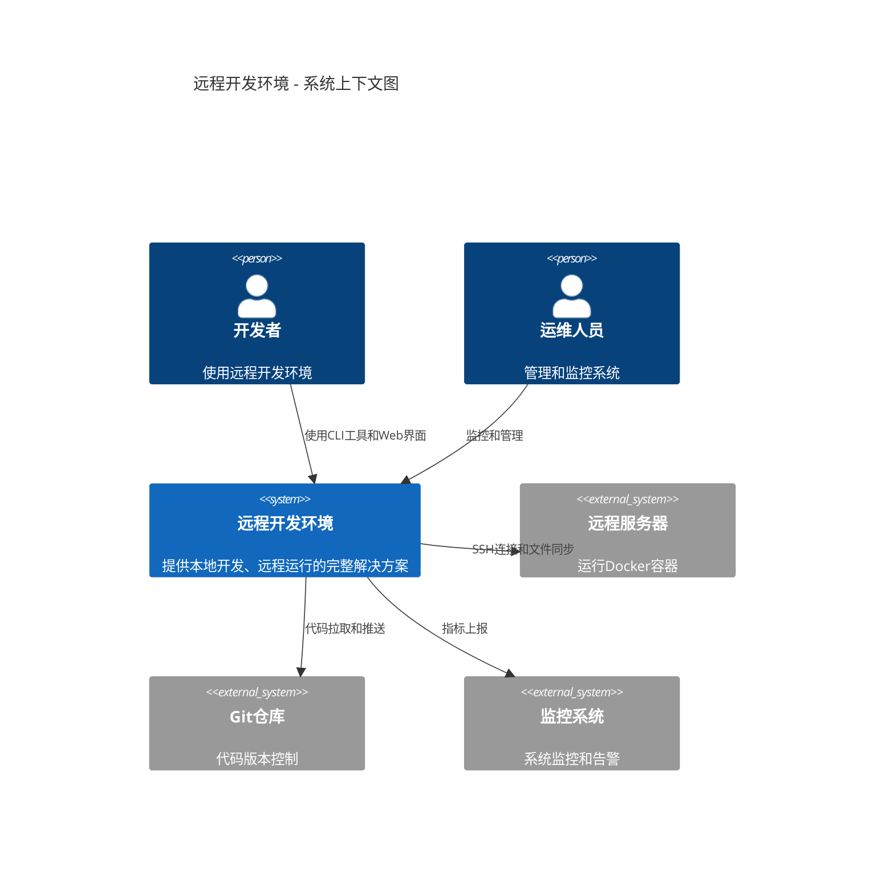

### 核心组件架构

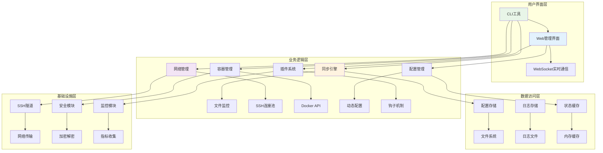

### 数据流架构

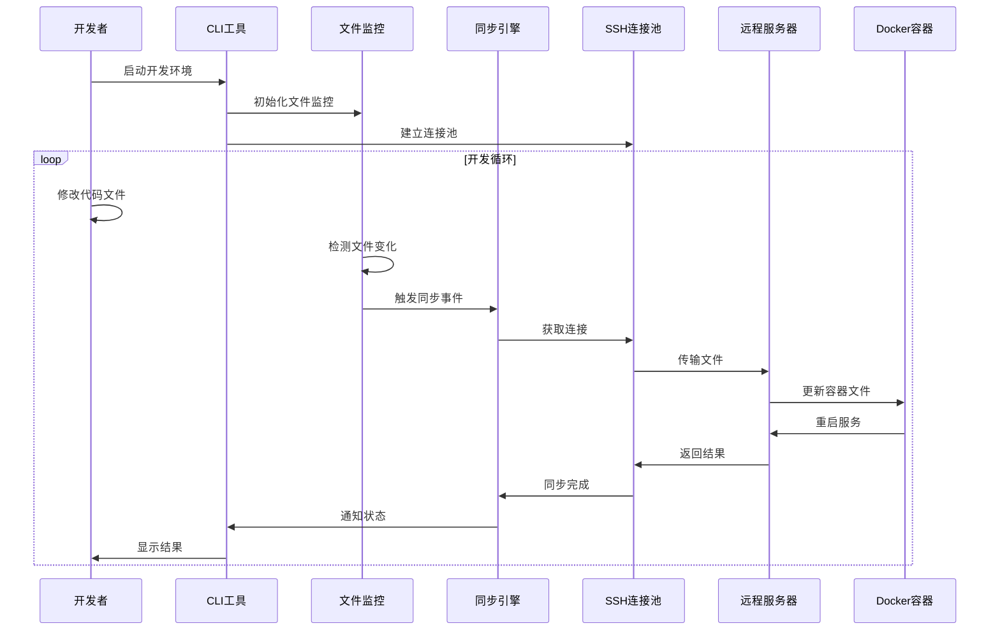

## 📁 项目结构详解

### 目录结构设计原则

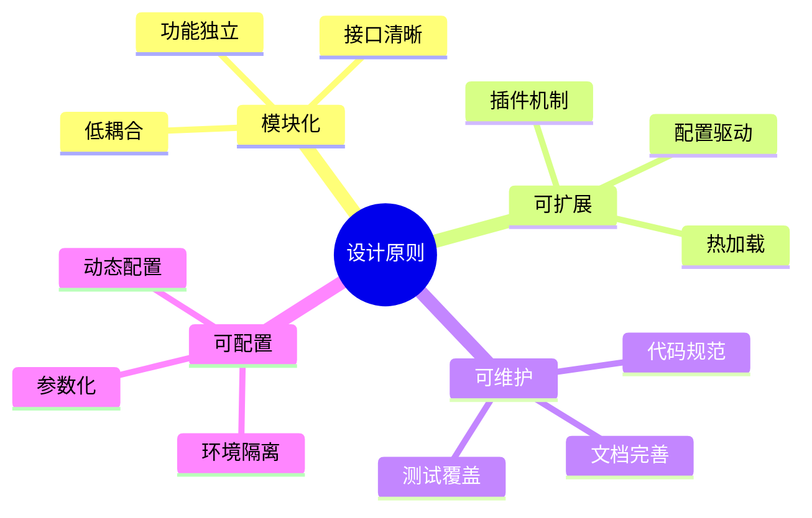

### 核心模块说明

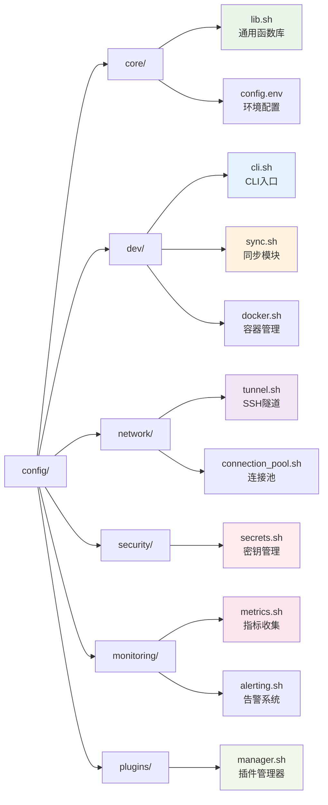

## 🔧 核心技术栈

### 技术选型

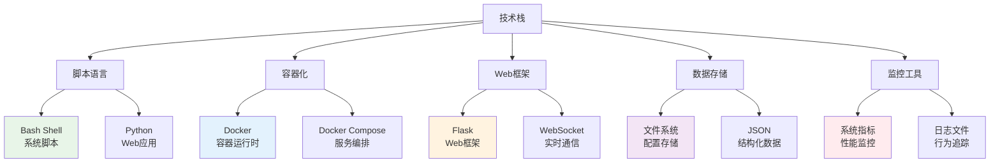

### 依赖关系图

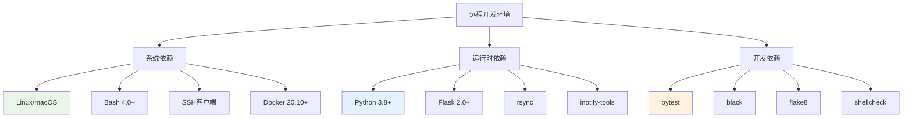

## 🔄 开发工作流

### Git工作流

```mermaid
gitgraph
    commit id: "main分支"
    branch develop
    checkout develop
    commit id: "develop分支"
    
    branch feature/sync-engine
    checkout feature/sync-engine
    commit id: "同步引擎开发"
    commit id: "单元测试"
    commit id: "集成测试"
    
    checkout develop
    merge feature/sync-engine
    commit id: "合并同步引擎"
    
    branch feature/web-ui
    checkout feature/web-ui
    commit id: "Web界面开发"
    commit id: "前端测试"
    
    checkout develop
    merge feature/web-ui
    commit id: "合并Web界面"
    
    checkout main
    merge develop
    commit id: "发布v1.0.0"
```

### 代码审查流程

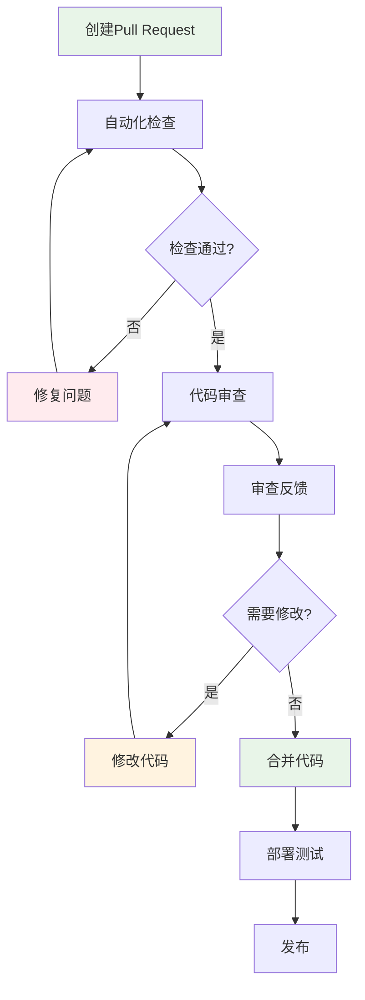

## 🧪 测试策略

### 测试金字塔

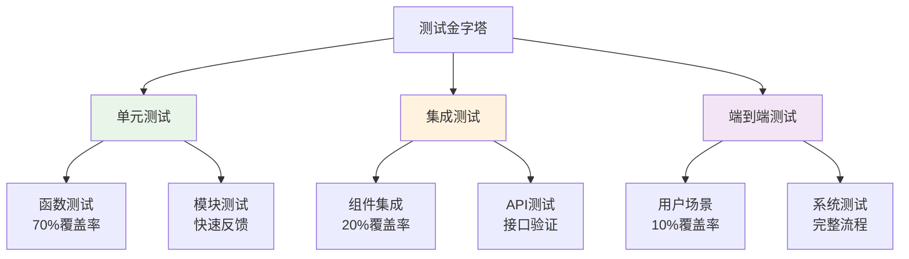

### 测试执行流程

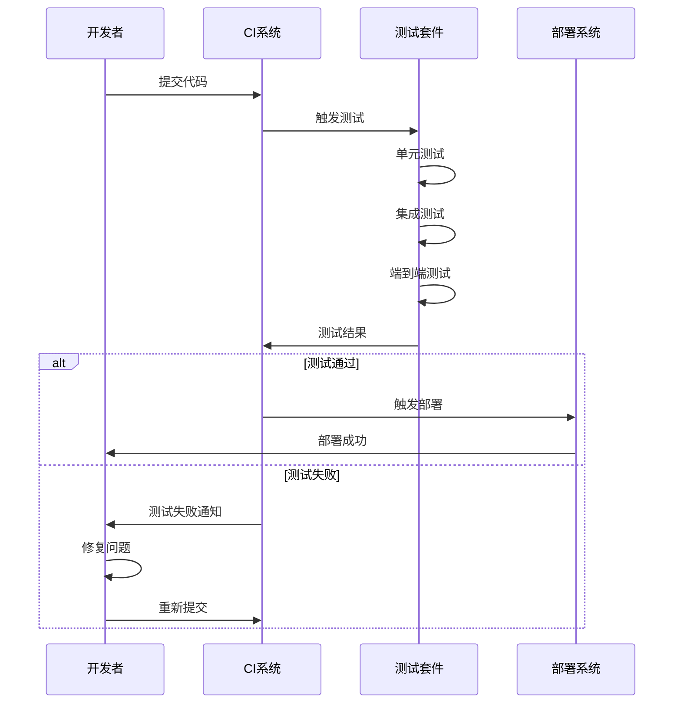

## 🔌 插件开发

### 插件架构

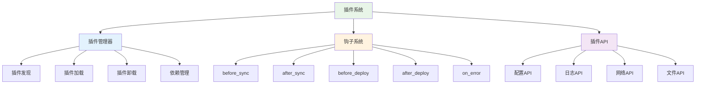

### 插件开发流程

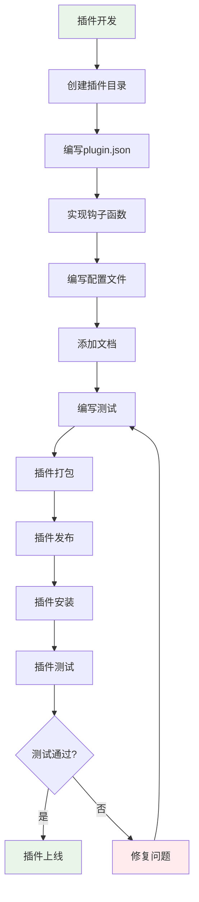

### 插件示例

```bash
# 插件目录结构
my-plugin/
├── plugin.json          # 插件元数据
├── install.sh          # 安装脚本
├── uninstall.sh        # 卸载脚本
├── config.yml          # 配置文件
├── README.md           # 插件文档
└── hooks/              # 钩子函数
    ├── before_sync.sh
    ├── after_sync.sh
    └── on_error.sh
```

## 🔐 安全设计

### 安全架构

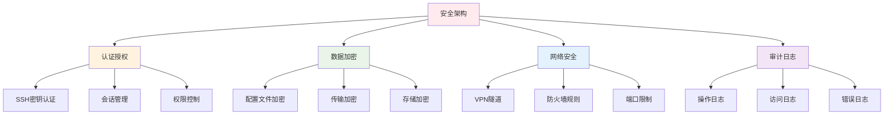

### 安全威胁模型

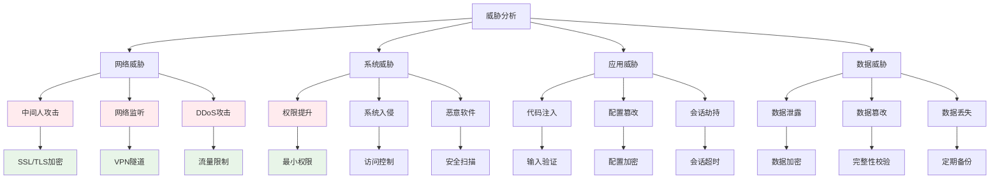

## 📊 性能优化

### 性能监控指标

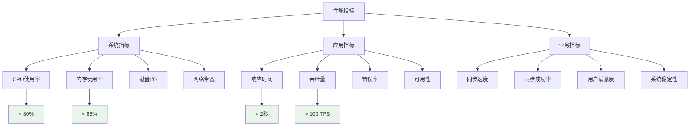

### 优化策略

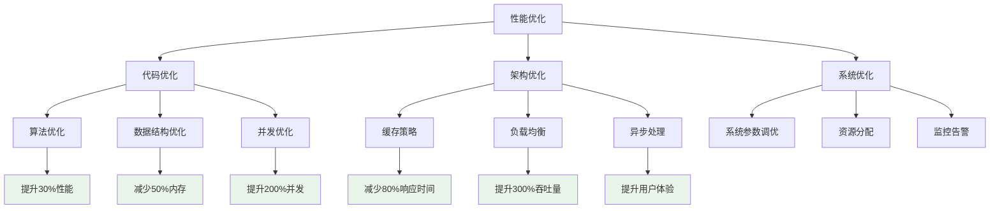

## 🚀 部署架构

### 部署环境

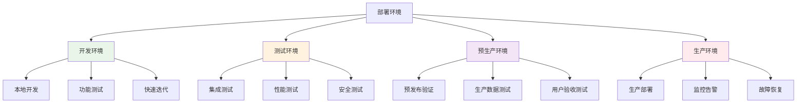

### CI/CD流水线

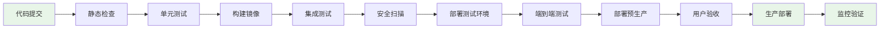

## 📋 开发规范

### 代码规范

```mermaid
mindmap
  root((代码规范))
    命名规范
      变量命名
        snake_case
        有意义的名称
        避免缩写
      函数命名
        动词开头
        功能描述
        参数清晰
    文档规范
      函数注释
        功能描述
        参数说明
        返回值
      文件头注释
        作者信息: Zhang-Jingdian (2157429750@qq.com)
        创建时间: 2025年7月14日
        功能描述
    错误处理
      异常捕获
      错误日志
      优雅降级
    测试规范
      单元测试
      集成测试
      覆盖率要求
```

### 提交规范

```mermaid
graph TD
    A[提交规范] --> B[提交类型]
    A --> C[提交格式]
    A --> D[提交内容]
    
    B --> E[feat: 新功能]
    B --> F[fix: 修复bug]
    B --> G[docs: 文档更新]
    B --> H[style: 代码格式]
    B --> I[refactor: 重构]
    B --> J[test: 测试]
    B --> K[chore: 构建]
    
    C --> L[type(scope): subject]
    C --> M[body]
    C --> N[footer]
    
    D --> O[简洁明了]
    D --> P[说明原因]
    D --> Q[影响范围]
    
    style E fill:#e8f5e8
    style F fill:#ffebee
    style G fill:#e3f2fd
    style H fill:#fff3e0
    style I fill:#f3e5f5
```

## 🔗 相关资源

- [用户手册](../user/README.md) - 用户使用指南
- [API文档](../api/README.md) - 接口详细说明
- [部署指南](../deployment/README.md) - 部署操作手册
- [故障排除](../troubleshooting/README.md) - 问题解决方案

---

> 🛠️ **开发者注意**: 这份开发指南包含了系统的核心技术细节，请仔细阅读并遵循相关规范！ 