# 🔧 故障排除指南

> 远程开发环境常见问题的诊断和解决方案，快速定位和修复系统故障

## 🚨 故障诊断流程

### 故障处理总览

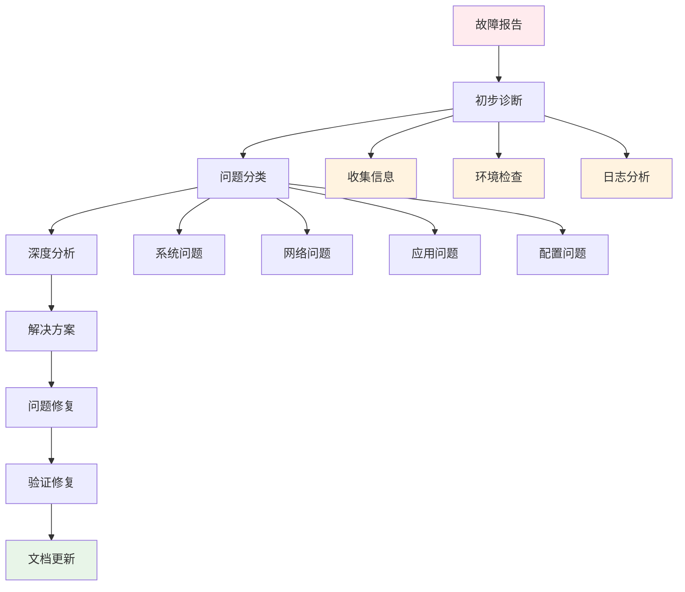

### 诊断决策树

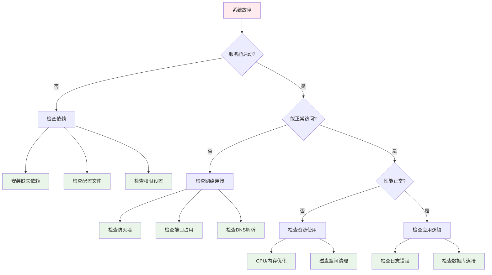

## 🔍 常见问题分类

### 问题类型分布

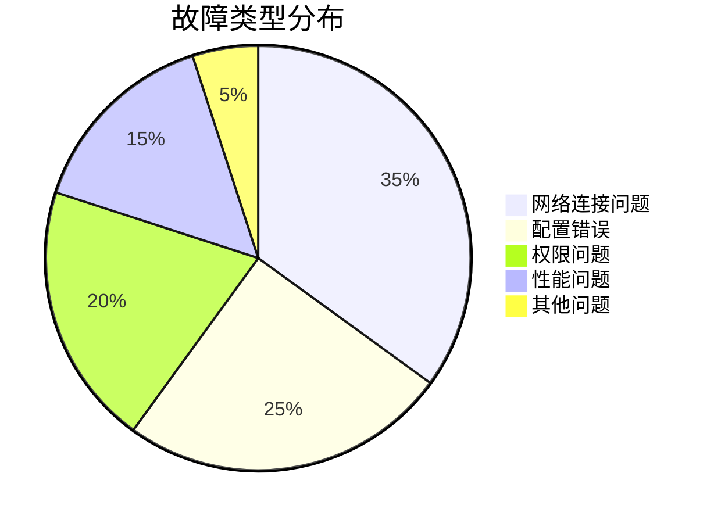

### 问题严重程度

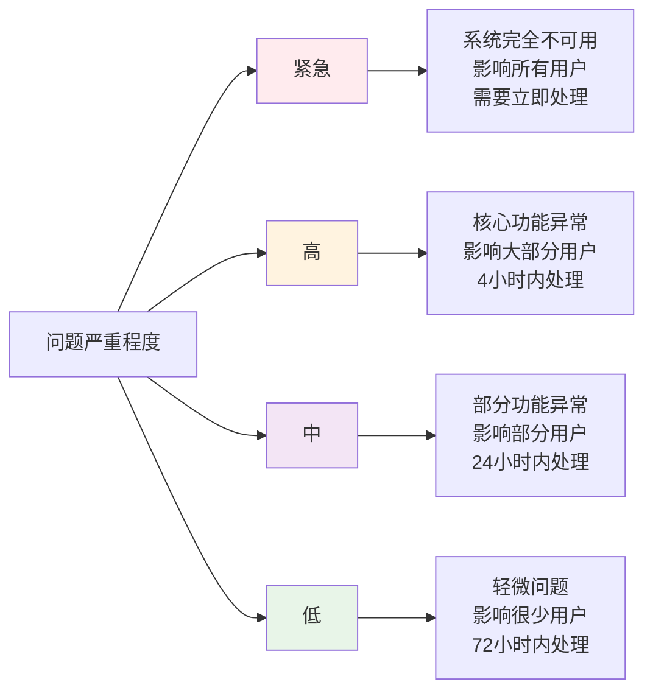

## 🌐 网络连接问题

### SSH连接故障

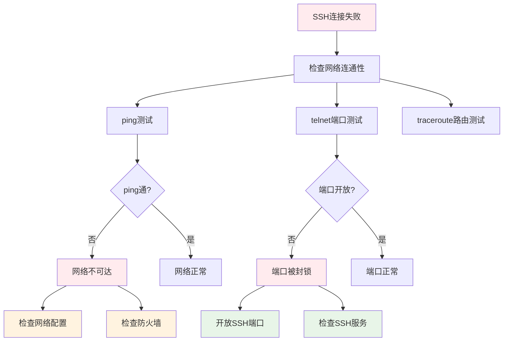

**解决方案:**

1. **网络连通性检查**
```bash
# 检查网络连接
ping -c 4 192.168.0.105

# 检查端口连通性
telnet 192.168.0.105 22

# 路由追踪
traceroute 192.168.0.105
```

2. **SSH服务检查**
```bash
# 检查SSH服务状态
sudo systemctl status sshd

# 重启SSH服务
sudo systemctl restart sshd

# 检查SSH配置
sudo sshd -t
```

3. **防火墙配置**
```bash
# 检查防火墙状态
sudo ufw status

# 开放SSH端口
sudo ufw allow 22

# 检查iptables规则
sudo iptables -L
```

### 隧道连接问题

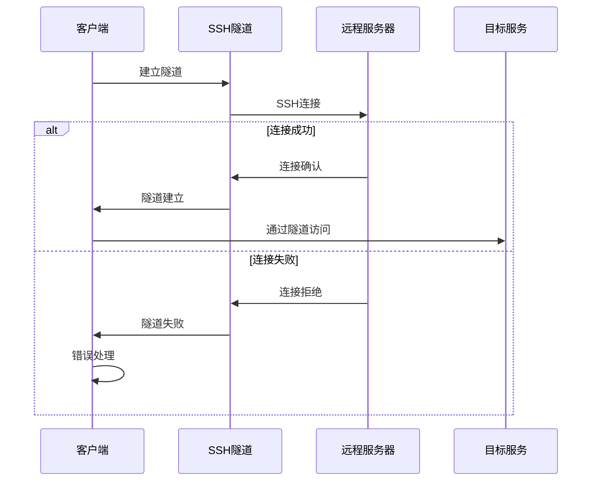

**诊断命令:**
```bash
# 检查隧道状态
./dev tunnel status

# 重新建立隧道
./dev tunnel restart

# 检查端口转发
netstat -tlnp | grep :8080
```

## ⚙️ 配置问题

### 配置文件错误

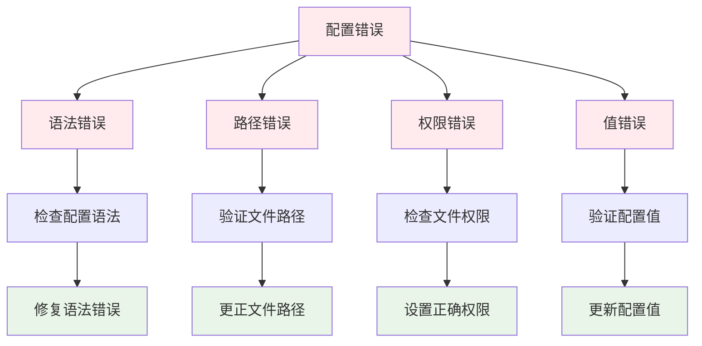

**配置验证工具:**

```bash
# 验证配置文件语法
./dev config validate

# 检查配置文件内容
./dev config show

# 测试配置文件
./dev config test
```

### 环境变量问题

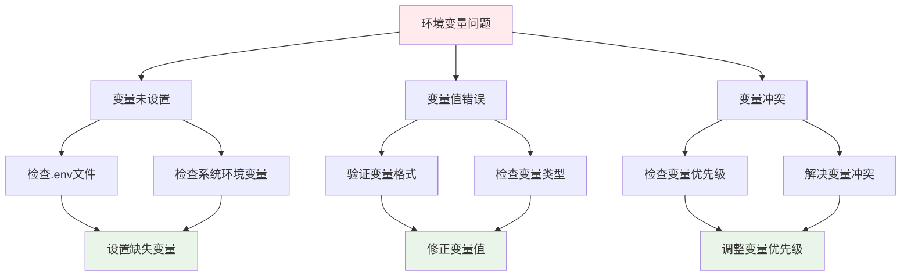

## 🔒 权限问题

### 文件权限错误

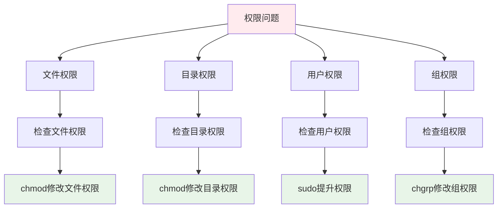

**权限诊断命令:**

```bash
# 检查文件权限
ls -la config/

# 检查目录权限
ls -ld logs/

# 修改文件权限
chmod 755 config/dev/cli.sh

# 修改目录权限
chmod 755 logs/

# 检查用户权限
id
groups

# 检查sudo权限
sudo -l
```

### SSH密钥权限

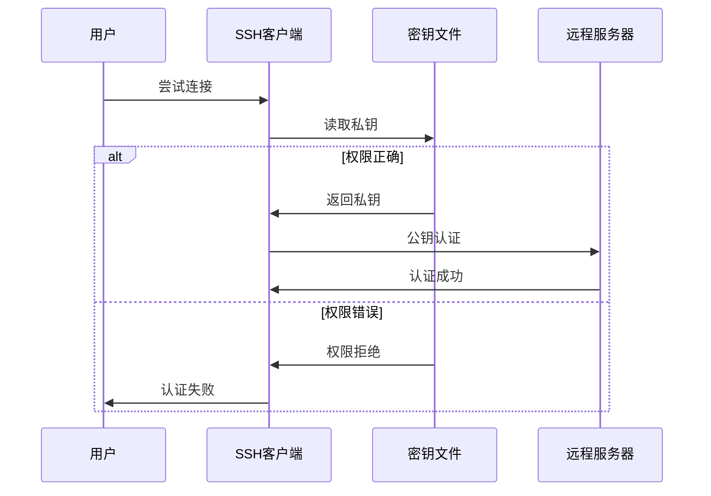

**SSH密钥权限修复:**

```bash
# 设置正确的密钥权限
chmod 600 ~/.ssh/id_ed25519
chmod 644 ~/.ssh/id_ed25519.pub
chmod 700 ~/.ssh/

# 检查密钥权限
ls -la ~/.ssh/

# 测试密钥连接
ssh -i ~/.ssh/id_ed25519 user@192.168.0.105
```

## 🚀 性能问题

### 系统资源监控

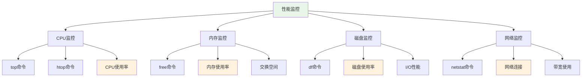

**性能诊断命令:**

```bash
# CPU监控
top -p $(pgrep -d',' -f "python.*app.py")
htop

# 内存监控
free -h
ps aux --sort=-%mem | head -10

# 磁盘监控
df -h
du -sh logs/
iostat -x 1

# 网络监控
netstat -tuln
ss -tuln
iftop
```

### 性能优化建议

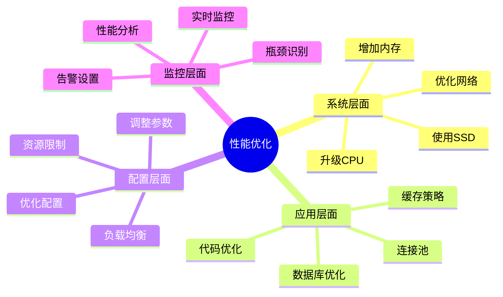

## 🐳 Docker问题

### 容器启动失败

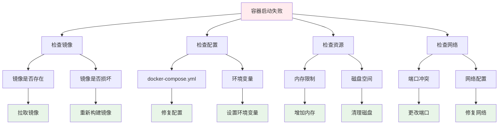

**Docker诊断命令:**

```bash
# 检查容器状态
docker ps -a

# 查看容器日志
docker logs <container_id>

# 检查镜像
docker images

# 检查Docker守护进程
docker info

# 清理Docker资源
docker system prune -a

# 检查端口占用
docker port <container_id>
```

### 容器网络问题

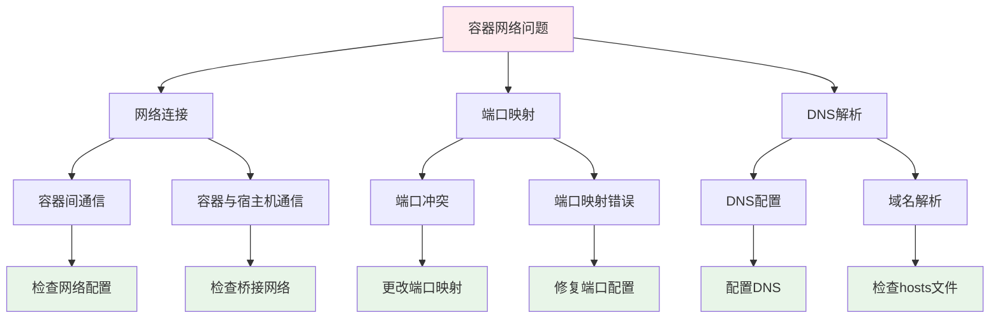

## 📝 日志分析

### 日志级别和类型

```mermaid
graph LR
    A[日志分析] --> B[系统日志]
    A --> C[应用日志]
    A --> D[错误日志]
    A --> E[访问日志]
    
    B --> F[/var/log/syslog]
    B --> G[systemd日志]
    
    C --> H[应用运行日志]
    C --> I[调试日志]
    
    D --> J[错误堆栈]
    D --> K[异常信息]
    
    E --> L[HTTP访问]
    E --> M[API调用]
    
    style A fill:#e8f5e8
    style B fill:#e3f2fd
    style C fill:#fff3e0
    style D fill:#ffebee
    style E fill:#f3e5f5
```

### 日志分析流程

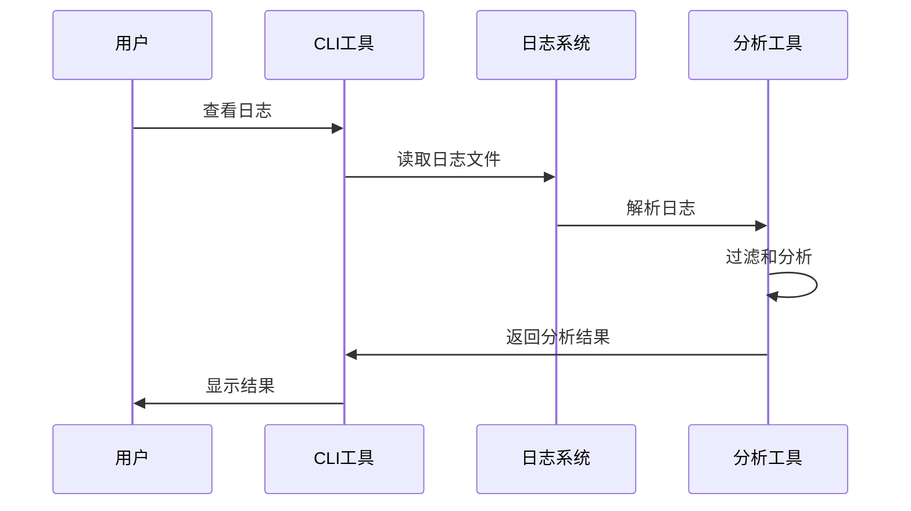

**日志分析命令:**

```bash
# 查看系统日志
sudo journalctl -u remote-dev-env

# 查看应用日志
./dev logs --tail=100

# 搜索错误日志
./dev logs --grep="ERROR"

# 实时查看日志
./dev logs --follow

# 按时间过滤日志
./dev logs --since="2024-07-14 06:00:00"

# 查看特定容器日志
./dev logs --container=web
```

## 🔧 自动化诊断工具

### 健康检查脚本

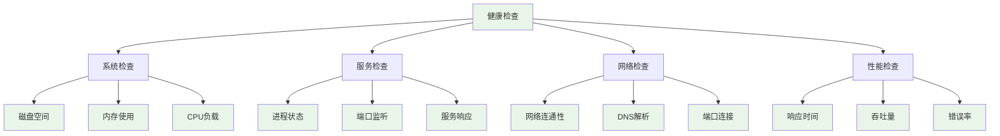

### 诊断脚本示例

```bash
#!/bin/bash
# 系统健康检查脚本

echo "🔍 开始系统健康检查..."

# 检查磁盘空间
echo "📁 检查磁盘空间..."
df -h | awk '$5 > 80 {print "⚠️  磁盘使用率过高: " $1 " " $5}'

# 检查内存使用
echo "🧠 检查内存使用..."
free -h | awk 'NR==2{printf "内存使用率: %.2f%%\n", $3/$2*100}'

# 检查服务状态
echo "🚀 检查服务状态..."
systemctl is-active --quiet docker && echo "✅ Docker服务正常" || echo "❌ Docker服务异常"

# 检查端口监听
echo "🔌 检查端口监听..."
netstat -tlnp | grep :8080 && echo "✅ 端口8080正常监听" || echo "❌ 端口8080未监听"

# 检查网络连接
echo "🌐 检查网络连接..."
ping -c 1 8.8.8.8 &>/dev/null && echo "✅ 网络连接正常" || echo "❌ 网络连接异常"

echo "✅ 健康检查完成！"
```

## 📞 技术支持

### 问题报告模板

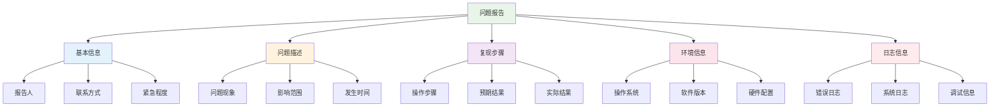

### 支持渠道

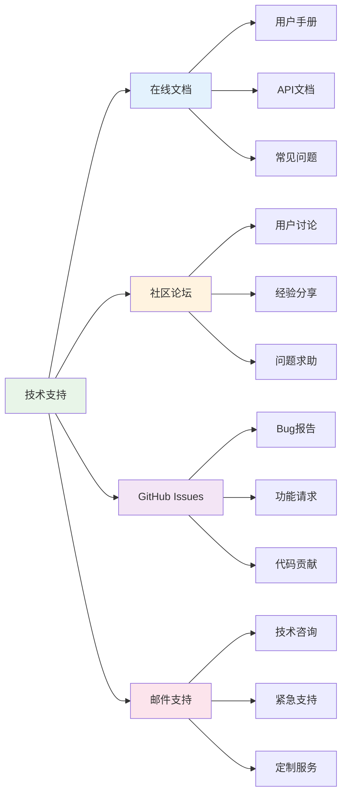

## 🔗 相关资源

- [用户手册](../user/README.md) - 基础使用指南
- [开发指南](../development/README.md) - 开发者文档
- [API文档](../api/README.md) - 接口详细说明
- [部署指南](../deployment/README.md) - 部署操作手册

---

> 🔧 **故障排除**: 这份指南提供了全面的故障诊断和解决方案，帮助快速定位和修复问题！ 