# 📖 用户手册

> 远程开发环境的完整使用指南，从新手入门到高级技巧

## 🚀 快速入门

### 用户角色定义

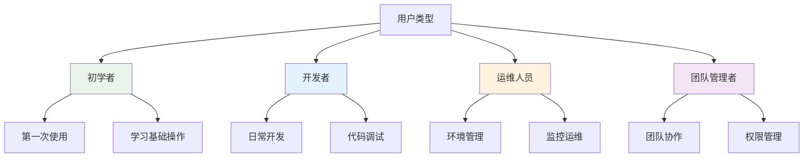

### 学习路径

```mermaid
journey
    title 用户学习路径
    section 第1天: 环境搭建
      安装依赖: 3: 用户
      配置SSH: 4: 用户
      首次启动: 5: 用户
    section 第2-3天: 基础操作
      文件同步: 4: 用户
      容器管理: 4: 用户
      Web界面: 5: 用户
    section 第4-7天: 进阶使用
      集群管理: 3: 用户
      插件系统: 3: 用户
      监控告警: 4: 用户
    section 第2周: 高级技巧
      性能优化: 4: 用户
      故障排除: 4: 用户
      团队协作: 5: 用户
```

## 🛠️ 基础操作指南

### 1. 环境初始化流程

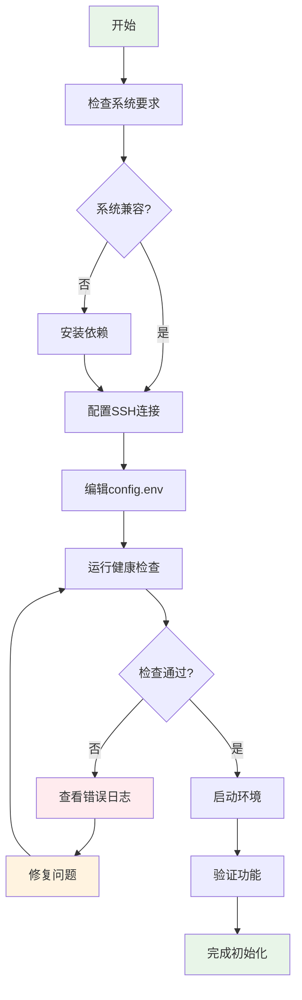

### 2. 日常开发工作流

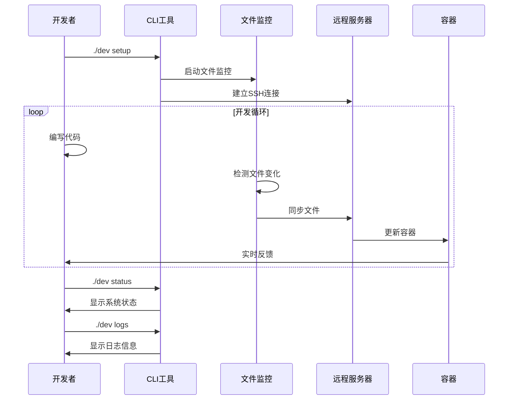

### 3. 常用命令速查

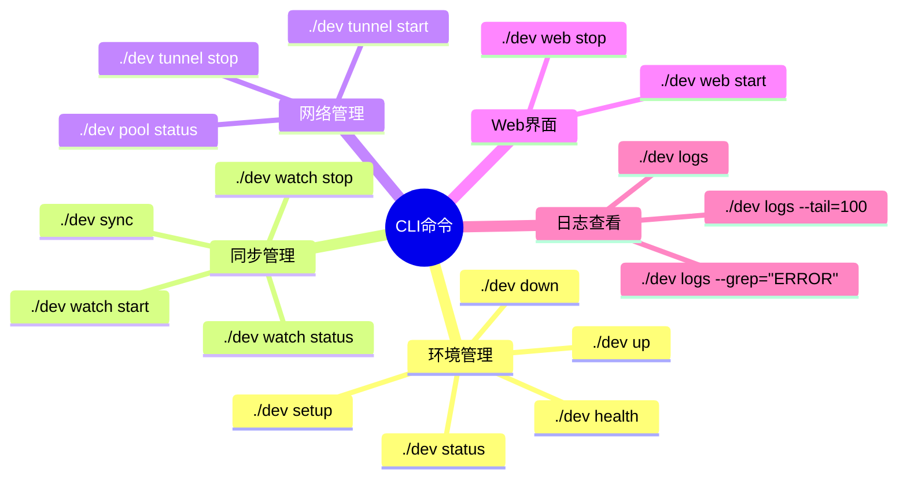

## 🔧 配置管理

### 配置文件结构

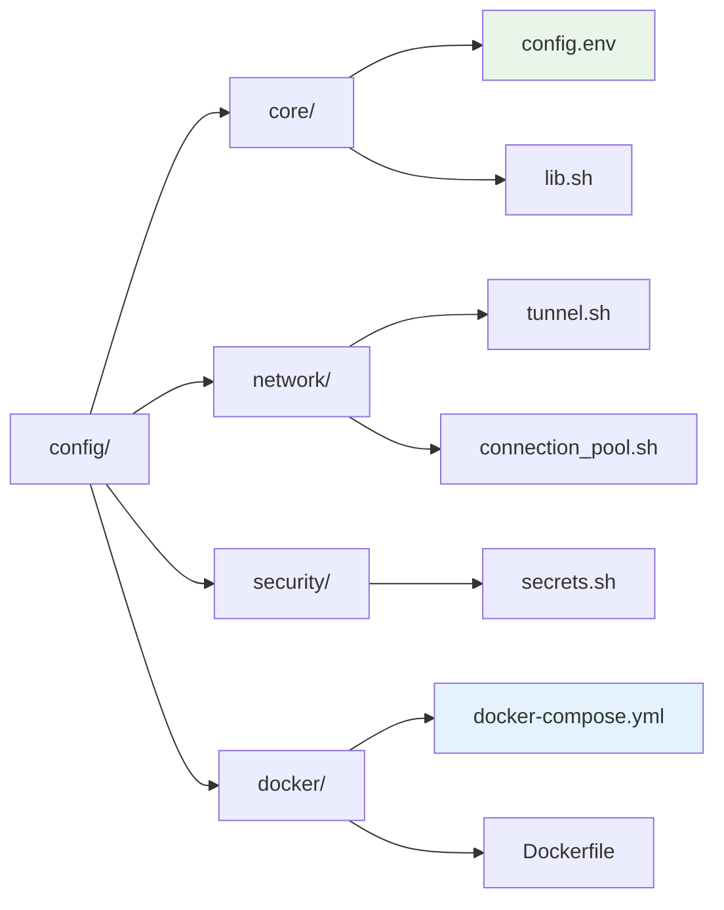

### 配置优先级

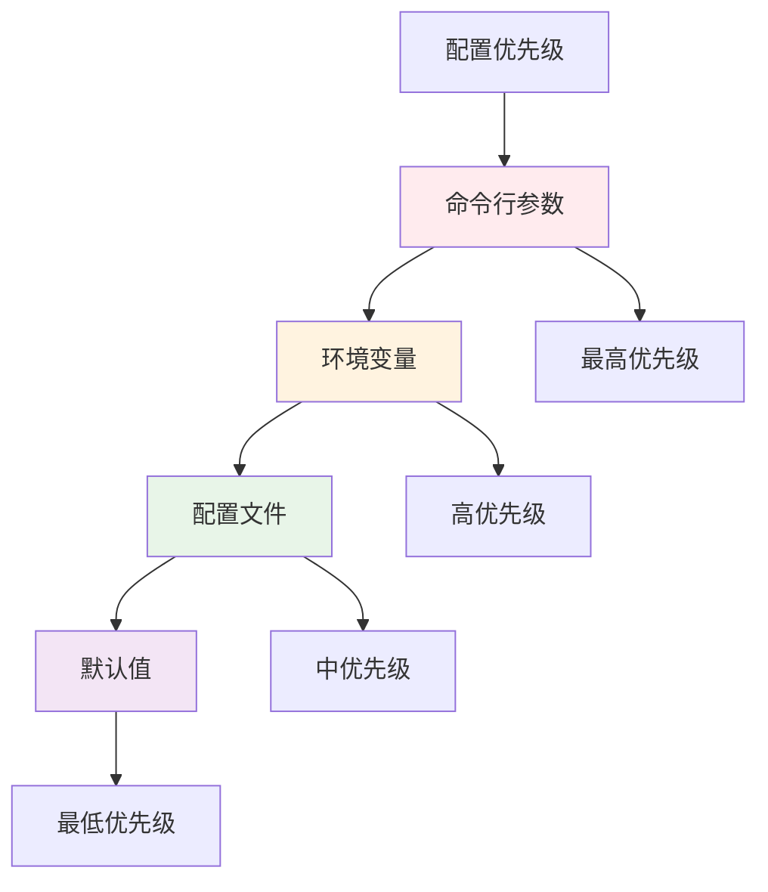

## 📊 Web管理界面使用

### 界面导航

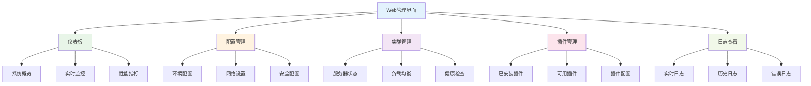

### 操作流程图

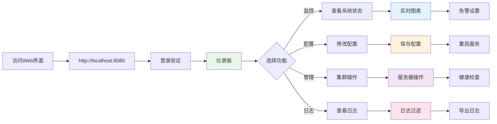

## 🚨 常见问题解决

### 问题诊断流程

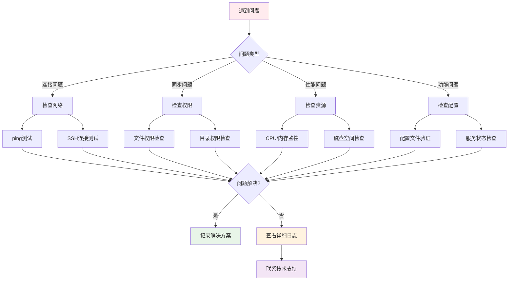

### 错误代码对照表

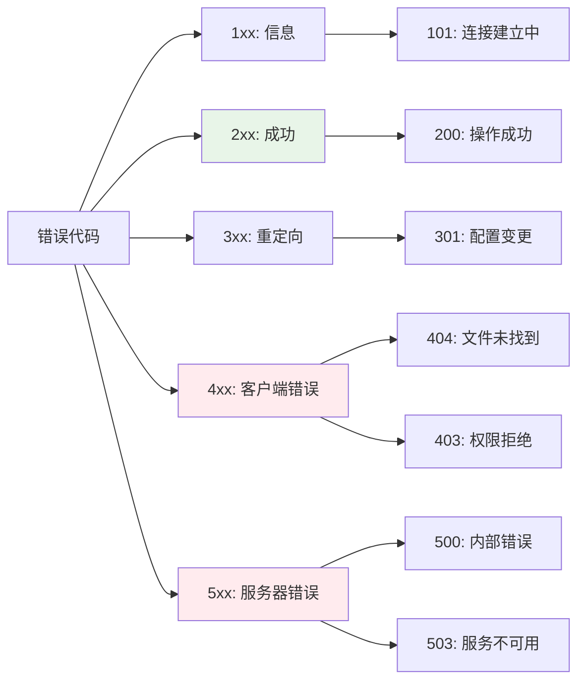

## 🎯 最佳实践

### 安全使用建议

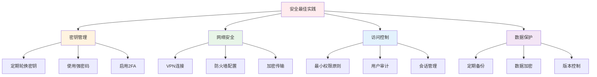

### 性能优化建议

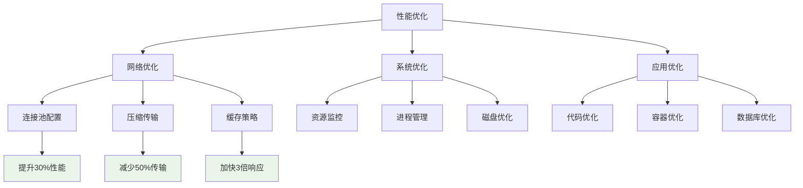

## 📈 监控与告警

### 监控指标体系

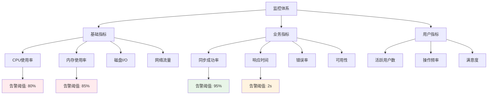

### 告警处理流程

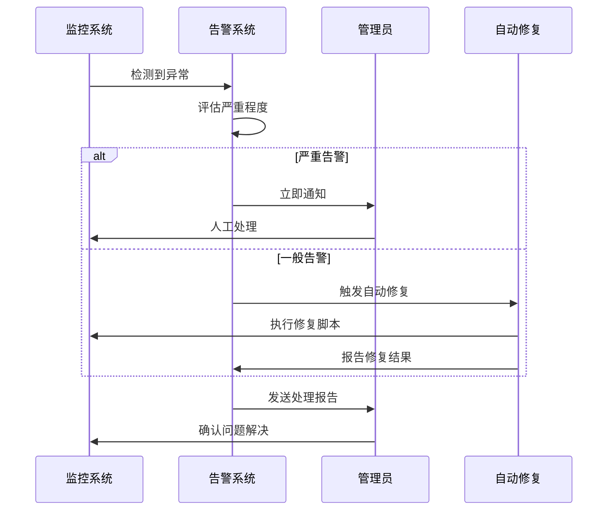

## 🤝 团队协作

### 多人协作模式

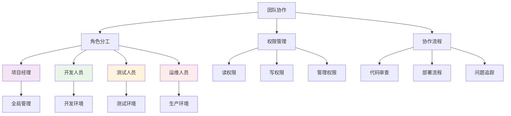

### 工作流程图

```mermaid
gitgraph
    commit id: "项目初始化"
    branch develop
    checkout develop
    commit id: "开发环境搭建"
    commit id: "功能开发"
    
    branch feature/auth
    checkout feature/auth
    commit id: "认证功能"
    commit id: "权限控制"
    
    checkout develop
    merge feature/auth
    commit id: "集成测试"
    
    checkout main
    merge develop
    commit id: "生产部署"
    
    checkout develop
    commit id: "持续开发"
```

## 📚 学习资源

### 推荐学习路径

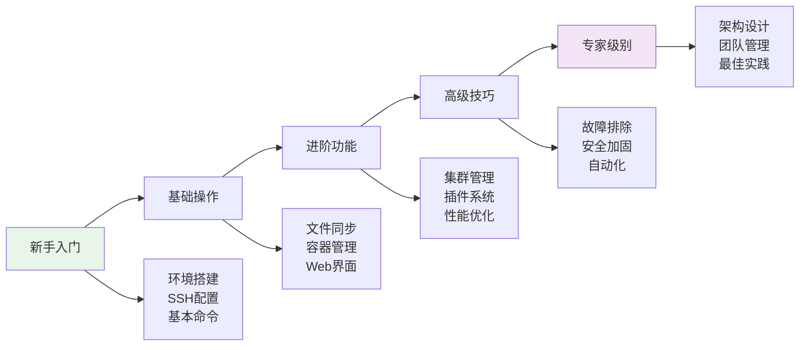

### 技能树

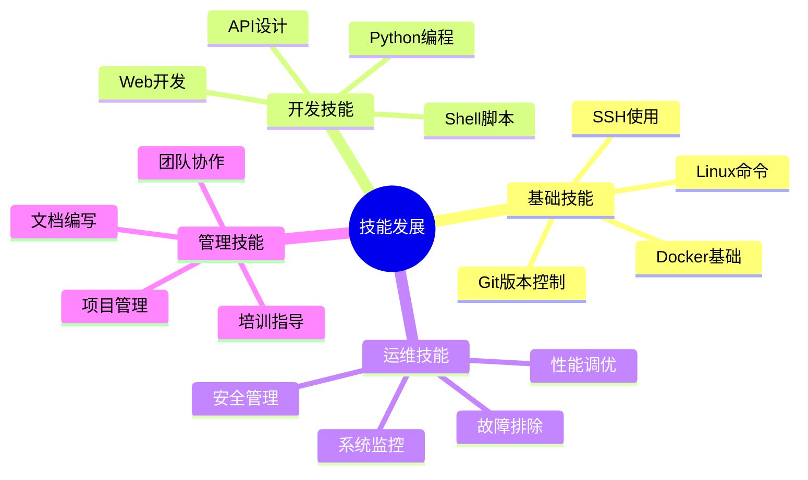

## 🔗 相关链接

- [开发指南](../development/README.md) - 深入开发文档
- [API文档](../api/README.md) - 接口说明
- [部署指南](../deployment/README.md) - 部署详细步骤
- [故障排除](../troubleshooting/README.md) - 问题解决方案

---

> 💡 **提示**: 这份用户手册会持续更新，如有问题请及时反馈！ 